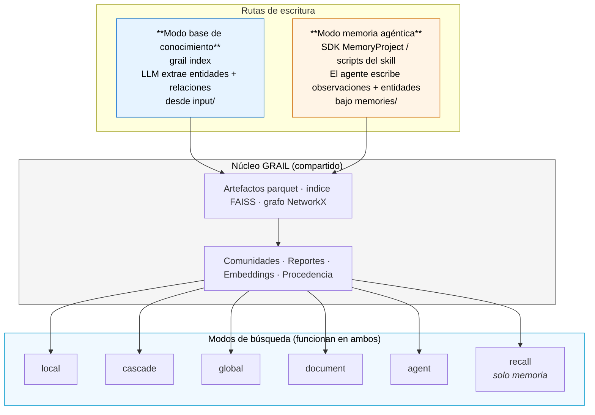
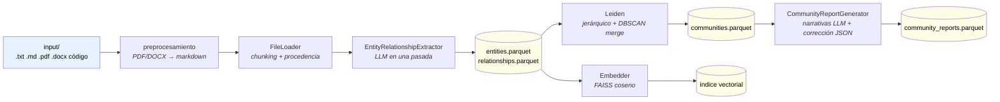
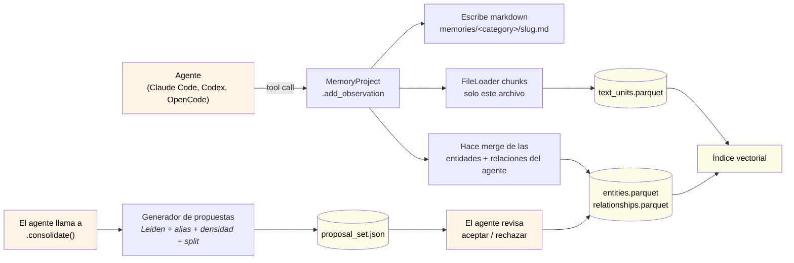
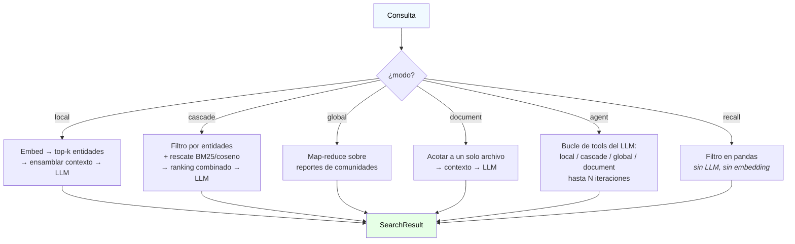

<p align="center">
  
</p>

<p align="center">
  <strong>Un solo motor de grafo, dos rutas de escritura: una base de conocimiento consultable sobre tus documentos, y una capa de memoria agéntica para Claude Code, Codex y OpenCode.</strong>
</p>

<p align="center">
  <sub><em>Vectores:</em> FAISS · LanceDB · ChromaDB &nbsp;|&nbsp; <em>Almacenamiento:</em> Local · S3 &nbsp;|&nbsp; <em>Endpoints LLM:</em> OpenAI · Anthropic · DeepInfra · Together · Groq · OpenRouter · Ollama · vLLM · SGLang · LM Studio</sub>
</p>

<p align="center">
  <a href="#instalación">Instalar</a> ·
  <a href="#inicio-rápido">Inicio rápido</a> ·
  <a href="#dos-modos-un-motor">Modos</a> ·
  <a href="#referencia-de-cli">CLI</a> ·
  <a href="#sdk-de-python">SDK</a> ·
  <a href="#almacenamiento-y-vector-stores">Backends</a> ·
  <a href="#benchmarks">Benchmarks</a> ·
  <a href="https://grail-docs.vercel.app/">Documentación</a>
</p>

<p align="center">
  📖 <strong>Documentación oficial:</strong> <a href="https://grail-docs.vercel.app/"><strong>grail-docs.vercel.app</strong></a> — tutoriales guiados, conceptos con analogías, referencia completa de CLI/SDK y recetas (ES + EN).
</p>

<p align="center">
  <em><a href="README.md">🇬🇧 English</a> · 🇪🇸 Español</em>
</p>

---

## Tabla de contenidos

1. [¿Qué es GRAIL?](#qué-es-grail)
2. [Dos modos, un motor](#dos-modos-un-motor)
3. [Por qué GRAIL](#por-qué-grail)
4. [Cómo funciona](#cómo-funciona)
5. [Instalación](#instalación)
6. [Inicio rápido](#inicio-rápido)
7. [SDK de Python](#sdk-de-python)
8. [Skill para agentes](#skill-para-agentes)
9. [Referencia de CLI](#referencia-de-cli)
10. [Modos de búsqueda](#modos-de-búsqueda)
11. [Tuneo de prompts — la mayor palanca de calidad](#tuneo-de-prompts--la-mayor-palanca-de-calidad)
12. [Almacenamiento y vector stores](#almacenamiento-y-vector-stores)
13. [Benchmarks](#benchmarks)
14. [Documentación](#documentación)
15. [Contribuir](#contribuir)
16. [Agradecimientos](#agradecimientos)
17. [Autor](#autor)
18. [Licencia](#licencia)

---

## ¿Qué es GRAIL?

**GRAIL** (Graph RAG with Advanced Integrations and Learning) es un framework open-source en Python que convierte texto en un grafo de conocimiento consultable, y lo expone a través de seis modos de recuperación, incluyendo un bucle de búsqueda agéntica y un modo estructural de recall.

Lo que diferencia a GRAIL de otros sistemas GraphRAG es que el mismo motor potencia **dos casos de uso completamente distintos** sobre los mismos artefactos (parquet + FAISS + NetworkX):

- **Modo base de conocimiento** — apuntas a una carpeta de documentos, ejecutas `grail index`, y consultas usando cualquiera de los seis modos de búsqueda. Como GraphRAG vanilla, pero con recuperación en cascada, búsqueda agéntica, actualizaciones incrementales y seguimiento honesto de costos.
- **Modo memoria agéntica** — incrustás GRAIL dentro de un agente (Claude Code, Codex, OpenCode, o cualquier framework que soporte el formato de skills) y dejás que escriba observaciones, entidades y relaciones directamente. El agente es dueño de la ruta de escritura; GRAIL mantiene el grafo coherente y consultable. El repositorio incluye un [skill listo para instalar](#skill-para-agentes).

Ambos modos comparten un único esquema, una sola capa de almacenamiento, y los mismos cinco modos de búsqueda — además de un modo `recall` exclusivo de memoria que se ejecuta sin ninguna llamada a un LLM. Podés correr ambas rutas de escritura sobre el mismo proyecto simultáneamente.

GRAIL trae endpoints agnósticos al proveedor: OpenAI, Anthropic, DeepInfra, Together, Groq, OpenRouter, Ollama, vLLM, SGLang y LM Studio son ciudadanos de primera clase. Cambiar de proveedor es un cambio de una línea en la configuración.

---

## Dos modos, un motor



### Cuándo usar cada uno

| Quieres… | Modo | Punto de entrada |
|---|---|---|
| Construir un bot de preguntas y respuestas sobre un corpus de documentos | `knowledge_base` | `grail init my-kb` |
| Incrustar memoria de largo plazo en un agente de programación (Claude Code, Codex, OpenCode) | `memory` | `grail init my-mem --memory` |
| Mezclar ambos — el agente escribe memorias *y* tú indexas documentos de referencia | ambos | `grail init my-mixed --memory`, luego copias docs en `input/` y corres `grail index` |

El contrato es vinculante: **todo lo que funciona en modo base de conocimiento funciona en modo memoria** — mismos parquets, mismo código de búsqueda. Solo cambia la ruta de escritura.

---

## Por qué GRAIL

| Capacidad | Qué significa | Dónde vive |
|---|---|---|
| **Dos rutas de escritura, un esquema** | Modo base de conocimiento y modo memoria agéntica producen los mismos artefactos parquet. Todos los modos de búsqueda funcionan en cualquiera de los dos. | `grail/core.py`, `grail/memory/project.py` |
| **Escrituras dirigidas por el agente** | `MemoryProject.add_observation(...)` permite a los agentes persistir memorias con entidades y relaciones explícitas. Sin paso de extracción por LLM — el llamador ya sabe lo que quiso decir. | `grail/memory/project.py:190` |
| **Carpetas como comunidades** | En modo memoria, la ruta de carpeta bajo `memories/` (ej. `work/clients/acme/`) declara la comunidad de la entidad. La multi-pertenencia es de primera clase. | `grail/memory/project.py` |
| **`consolidate()` como generador de propuestas** | Ejecuta análisis de Leiden + densidad de aristas + detección de alias + división de carpetas y emite un archivo estructurado de propuestas. El agente revisa; nada muta sin su consentimiento. | `grail/memory/consolidate.py`, `grail/memory/analyses/` |
| **Búsqueda en cascada** | Híbrido de filtrado por entidades + rescate de texto vía BM25/coseno. Recupera hechos que viven en chunks donde ninguna entidad fue extraída. | `grail/query/cascade_search.py` |
| **Búsqueda agéntica** | Bucle de tool-calling impulsado por el LLM que elige entre local / cascade / global / document por pregunta, con respaldo de síntesis forzada. | `grail/query/agent.py` |
| **Modo recall** | Filtro puro en pandas sobre `observed_at` / `category` / `tag` / `entity` / `confidence` — cero LLM, cero embedding. Pensado para replay de memoria. | `grail/query/recall_search.py`, `grail/query/recall_filter.py` |
| **Actualizaciones incrementales** | `append` / `edit` / `delete` re-extraen solo las unidades de texto afectadas. Un planificador por razón de cambio (umbral 0.3) actualiza comunidades sin reconstrucción completa. | `grail/indexing/incremental_community.py` |
| **Extracción en una sola pasada (modo KB)** | Entidades + relaciones + descripciones + 2–3 consultas de recuperación anticipadas en una sola llamada al LLM por chunk — significativamente menos round-trips que sistemas que corren pasos separados. | `grail/indexing/entities_relationships.py` |
| **Consultas de recuperación en las entidades** | Cada entidad almacena 2–3 preguntas anticipadas en su texto de embedding. Mejora el matching translingüístico y por intención. | `grail/indexing/entities_relationships.py` |
| **Relaciones tipadas** | Clasificación opcional por LLM de las aristas (`REGULATES`, `FUNDS`, …). Tres modos: deshabilitado, libre, vocabulario restringido. | `grail/config.py:IndexingConfig` |
| **Prompts personalizables** | Los 10 prompts (`entity_relation`, `community_report`, `local_search`, …) son módulos Python override-ables. Tunealos para tu dominio — extracción más precisa, voz fijada, packs multilingüales. → [Guía de tuneo](https://grail-docs.vercel.app/guides/prompt-tuning) | `grail/prompts/builtin/` |
| **Procedencia a nivel de archivo** | Cada unidad de texto retiene punteros hacia los archivos fuente. Las citas referencian documentos reales. | `grail/indexing/loader.py` |
| **Seguimiento honesto de costos** | Distingue precios `complete` / `partial` / `undefined`. Nunca reporta un `$0.00` falso cuando el precio es desconocido. | `grail/llm/cost.py` |
| **Envoltorio unificado `Reply`** | Cada método de `MemoryProject` devuelve `Reply(ok, data, warnings, next_steps, error)` — mismo contrato para el SDK y los scripts del skill. | `grail/memory/types.py` |
| **Almacenamiento y vectores multi-backend** | Local o S3; FAISS (default cosine), LanceDB o ChromaDB. | `grail/storage/`, `grail/vectorstores/` |
| **Dos UIs de referencia** | Chat de terminal en Textual y chat web en FastAPI + React — ambos incrustan GRAIL como librería. | `grail/apps/cli_chat/`, `grail/apps/chat/` |

---

## Cómo funciona

### Pipeline de indexación (base de conocimiento)

<p align="center">
  
</p>



### Ruta de escritura en modo memoria

<p align="center">
  
</p>



### Flujo de consulta (funciona en ambos modos)



---

## Instalación

```bash
git clone git@github.com:CAMARA-CHILENA-INTELIGENCIA-ARTIFICIAL/GRAIL.git
cd GRAIL

# Recomendado: uv (https://github.com/astral-sh/uv)
uv venv --python 3.12
uv pip install -e ".[dev]"          # agrega ",s3" para S3, ",ui" para el chat web

# O con pip
python3.12 -m venv .venv && source .venv/bin/activate
pip install -e ".[dev]"
```

Define las API keys del/los endpoint(s) que vayas a usar:

```bash
cp .env.example .env
# edita .env — OPENAI_API_KEY, DEEPINFRA_API_KEY, ANTHROPIC_API_KEY, …
```

Los endpoints incorporados cubren `openai`, `anthropic`, `deepinfra`, `together`, `groq`, `openrouter`, `ollama`, `vllm`, `sglang`, `lmstudio`, `local`. Agrega los tuyos:

```yaml
# endpoints.yaml
endpoints:
  my-vllm:
    base_url: http://my-vllm.local:8000/v1
    api_key_env: MY_VLLM_KEY
    requires_key: false
```

---

## Inicio rápido

### Modo base de conocimiento

```bash
# 1. Crea el proyecto (low_cost_setup trae defaults pre-tuneados para DeepInfra)
uv run grail init ./my-kb --name my-kb --template low_cost_setup

# 2. Copia archivos .txt / .md / .pdf / .docx / código en ./my-kb/input/

# 3. Indexa
uv run grail index ./my-kb
```

> 👉 Walkthrough completo con capturas y resolución de problemas: [Quickstart de base de conocimiento](https://grail-docs.vercel.app/start/kb-quickstart).

```bash
# 4. Consulta — seis modos
uv run grail query ./my-kb "¿Cuáles son los temas principales?"      --mode global
uv run grail query ./my-kb "¿Quién es Alice?"                        --mode local
uv run grail query ./my-kb "¿Qué dosis especifica el protocolo X?"   --mode cascade
uv run grail query ./my-kb "Resume law-21250.pdf"                    --mode document -d law-21250.pdf
uv run grail query ./my-kb "Compara tratamiento temprano vs avanzado." --mode agent

# 5. Conversa con el proyecto
uv run grail chat ./my-kb              # TUI en Textual
uv run grail ui   ./my-kb              # FastAPI + React, http://127.0.0.1:8765
```

> 👉 Ver la [guía del chat web](https://grail-docs.vercel.app/guides/web-chat) y la [guía del chat de terminal](https://grail-docs.vercel.app/guides/cli-chat) para capturas, slash commands, atajos de teclado y walkthroughs por feature.

### Modo memoria agéntica

```bash
# 1. Crea un proyecto de memoria
uv run grail init ./my-mem --memory

# 2. Dirígelo desde tu agente (ejemplo de SDK más abajo). El agente escribe
#    observaciones markdown bajo ./my-mem/memories/<category>/ y las entidades
#    se mergean al parquet en cada escritura.

# 3. Recall — filtro puro en pandas, sin LLM
uv run grail query ./my-mem --mode recall --since 7d --tag "decision"
uv run grail query ./my-mem --mode recall --category "work/clients/acme/**"

# 4. Cascade con filtro de memoria — combina búsqueda semántica y alcance estructural
uv run grail query ./my-mem "¿Qué decidimos sobre la migración?" \
  --mode cascade --since 30d --tag "decision"

# 5. Consolida — genera propuestas (mergear alias, descubrir comunidades, …)
uv run grail consolidate ./my-mem
uv run grail proposals list  ./my-mem
uv run grail proposals apply ./my-mem --accept <proposal_id>
```

> 👉 Workflow completo de memoria — observaciones, recall, consolidate, propose / accept — con ejemplos: [Quickstart de memoria](https://grail-docs.vercel.app/start/memory-quickstart).

---

## SDK de Python

GRAIL es ante todo una librería. La CLI es solo un wrapper sobre la misma API de Python.

### Modo base de conocimiento

```python
import asyncio
from grail import GRAIL, load_config

async def main():
    grail = GRAIL.from_config(load_config("./my-kb"))

    # Pipeline completo.
    await grail.index()

    # Los seis modos de búsqueda devuelven el mismo SearchResult.
    answer = await grail.search("¿Cuáles son los temas principales?", mode="global")
    print(answer.response)

    answer = await grail.agent_search("Compara tratamiento temprano vs avanzado.")
    print(answer.response)

    # Las actualizaciones incrementales tocan solo las unidades de texto afectadas.
    await grail.append(["new_doc.pdf"])
    await grail.edit({"existing.md": "/path/to/updated.md"})
    await grail.delete(["obsolete.txt"])

    # Ledger de costos honesto.
    print(grail.cost_tracker.render_total_cost())

asyncio.run(main())
```

### Modo memoria agéntica

```python
import asyncio
from grail import MemoryProject

async def main():
    mp = MemoryProject("./my-mem")

    # El agente escribe una observación con entidades + relaciones explícitas.
    # Sin extracción por LLM — el llamador ya sabe lo que quiso decir.
    reply = await mp.add_observation(
        title="Acme eligió Postgres sobre DynamoDB",
        content="En la revisión de arquitectura del martes, Acme se comprometió "
                "con Postgres para el servicio de historial de órdenes por las "
                "necesidades transaccionales entre las tablas de inventario y pagos.",
        category="work/clients/acme",
        tags=["decision", "architecture"],
        entities=[
            {"name": "Acme",     "type": "ORGANIZATION", "description": "Cliente"},
            {"name": "Postgres", "type": "TECHNOLOGY",   "description": "BD elegida"},
            {"name": "DynamoDB", "type": "TECHNOLOGY",   "description": "Alternativa rechazada"},
        ],
        relationships=[
            {"source": "Acme", "target": "Postgres", "relationship_type": "CHOSE",
             "description": "por historial de órdenes transaccional"},
            {"source": "Acme", "target": "DynamoDB", "relationship_type": "REJECTED",
             "description": "no soporta transacciones entre tablas"},
        ],
        confidence=0.95,
    )
    print(reply.ok, reply.data["observation_id"])

    # Recall — sin LLM, solo filtro estructural.
    recall = await mp.recall(
        mode="recall",
        category="work/clients/acme/**",
        tags=["decision"],
        since="30d",
    )
    for obs in recall.data["observations"]:
        print(obs["observed_at"], obs["title"])

    # Cascade con el mismo filtro, así la búsqueda semántica queda acotada
    # a decisiones recientes de Acme.
    answer = await mp.recall(
        "¿Por qué Acme descartó DynamoDB?",
        mode="cascade",
        category="work/clients/acme/**",
        since="30d",
    )
    print(answer.data["response"])

    # Consolidate — corre los análisis de propuestas; el agente revisa cada ítem.
    proposals = mp.consolidate()
    for p in proposals.data.get("proposals", []):
        print(p["kind"], p["confidence"], p["rationale"])

asyncio.run(main())
```

Cada método de `MemoryProject` retorna un envoltorio `Reply(ok, data, warnings, next_steps, error)` — la misma forma que emiten los scripts del skill, por lo que los llamadores del SDK y los agentes con tool-calling leen las mismas claves.

El SDK de memoria está diseñado para ser envuelto por skills (formato `SKILL.md`) que se ejecutan dentro de **Claude Code**, **OpenAI Codex**, **OpenCode** o cualquier otro framework que soporte la convención estándar de skills. Las rutas de descubrimiento difieren por framework; el cuerpo del skill es portable.

Ver la [referencia del SDK de Python](https://grail-docs.vercel.app/reference/python-sdk), el ejemplo ejecutable [`examples/quickstart/quickstart.py`](examples/quickstart/quickstart.py) y la referencia canónica de integración en [`grail/apps/chat/server.py`](grail/apps/chat/server.py).

---

## Skill para agentes

GRAIL trae un **skill portable para agentes** en [`skills/grail/`](skills/grail/) que permite a un agente de programación manejar una base de conocimiento o mantener su propia memoria directamente a través de tool calls — sin necesidad de un arnés de Python del lado del agente.

El skill sigue la convención estándar de carpeta `SKILL.md` compartida por **Claude Code**, **OpenAI Codex** y otros frameworks que adopten ese formato, así que la misma carpeta funciona en todos ellos con rutas de instalación específicas por framework.

### Qué contiene

```
skills/grail/
├── SKILL.md              ← descripción del skill + lenguaje de activación para el agente
├── INSTALL.md            ← rutas de instalación por framework
├── requirements.txt
├── scripts/              ← un script CLI por operación primitiva
│   ├── setup.sh          ← idempotente: instala grail en la primera llamada
│   ├── init_project.py
│   ├── list_grail_projects.py
│   ├── status.py
│   ├── index.py · append.py · edit.py · delete.py · explore.py · query.py · env_check.py
│   └── memory/                   ← herramientas de modo memoria
│       ├── add_observation.py
│       ├── add_entity.py · add_relationship.py · add_community.py
│       ├── find_similar_entity.py
│       ├── recall.py
│       ├── consolidate.py · list_proposals.py · apply_proposal.py
├── agents/openai.yaml    ← sidecar para Codex (metadata aditiva)
├── references/           ← contexto extenso que el agente lee bajo demanda
│   ├── kb_mode.md · memory_mode.md · memory_tools.md
│   ├── proposals.md · search_modes.md · query_optimization.md
│   └── config_reference.md · troubleshooting.md
└── assets/
```

### Instalación

```bash
# Claude Code — scope de usuario (symlink para que `git pull` actualice el skill)
mkdir -p ~/.claude/skills
ln -s "$(pwd)/skills/grail" ~/.claude/skills/grail

# OpenAI Codex — scope de usuario
mkdir -p ~/.agents/skills
ln -s "$(pwd)/skills/grail" ~/.agents/skills/grail

# Scope de proyecto — empaqueta el skill dentro de un repo donde quieras auto-descubrimiento
mkdir -p .claude/skills
ln -s "$(realpath skills/grail)" .claude/skills/grail
```

| Framework | Instalación scope usuario | Instalación scope proyecto |
|---|---|---|
| Claude Code (CLI + claude.ai) | `~/.claude/skills/grail/` | `<repo>/.claude/skills/grail/` |
| OpenAI Codex | `~/.agents/skills/grail/` | `<repo>/.agents/skills/grail/` |
| Otros frameworks que soporten `SKILL.md` | directorio de skills específico del framework | igual |

El skill auto-instala GRAIL mediante `scripts/setup.sh` en la primera llamada. Es idempotente — seguro de invocar en cada sesión. Ver [`skills/grail/INSTALL.md`](skills/grail/INSTALL.md) para detalles completos, incluyendo cómo verificar la instalación (`scripts/env_check.py`).

### Cómo lo usa un agente

Cada primitiva es un único script CLI que devuelve un envoltorio JSON `Reply` (`{ok, data, warnings, next_steps, error}`) — la misma forma que usa el SDK de Python, así que el agente lee las mismas claves sin importar cómo invoque a GRAIL.

Una sesión típica de modo memoria dentro del agente:

```bash
python scripts/list_grail_projects.py
# → qué proyectos existen, su modo (knowledge_base o memory)

python scripts/status.py --project my-mem
# → modo, conteos de artefactos, last_indexed_at; el agente decide en base a `mode`

python scripts/memory/add_observation.py \
  --project my-mem \
  --title "Acme eligió Postgres sobre DynamoDB" \
  --content "..." \
  --category "work/clients/acme" \
  --tag decision --tag architecture \
  --entities '[{"name":"Acme","type":"ORGANIZATION"},{"name":"Postgres","type":"TECHNOLOGY"}]' \
  --relationships '[{"source":"Acme","target":"Postgres","relationship_type":"CHOSE"}]'

python scripts/memory/recall.py --project my-mem --since 7d --tag decision

python scripts/memory/consolidate.py     --project my-mem
python scripts/memory/list_proposals.py  --project my-mem
python scripts/memory/apply_proposal.py  --project my-mem --accept <proposal_id>
```

El cuerpo del skill (descripción de `SKILL.md`, referencias y scripts) es totalmente portable entre frameworks; solo la ruta de descubrimiento difiere. Ver [`skills/grail/SKILL.md`](skills/grail/SKILL.md) para el lenguaje de activación dirigido al agente y la lógica de ruteo.

---

## Referencia de CLI

Todos los comandos toman un directorio de proyecto como primer argumento posicional.

### `grail init` — crea un proyecto

```bash
grail init <project_dir> [--name NAME] [--memory]
                         [--template TEMPLATE] [--templates-dir DIR]
                         [--overwrite] [--git/--no-git] [--list-templates]
```

| Flag | Descripción |
|---|---|
| `--memory` | **Crea un proyecto en modo memoria** (carpeta `memories/`, ruta de escritura dirigida por el agente). El default es modo `knowledge_base` (carpeta `input/`, flujo `grail index`). |
| `--name` | Nombre del proyecto (por defecto el nombre del directorio). |
| `--template`, `-t` | Pack de plantillas (ej. `low_cost_setup`) o uno propio bajo `--templates-dir`. Mutuamente excluyente con `--memory`. |
| `--templates-dir` | Directorio adicional para buscar plantillas. |
| `--overwrite` | Sobrescribe un scaffold existente. |
| `--git/--no-git` | Inicializa repo git. Default: **on** para modo memoria, off para modo KB. |
| `--list-templates` | Lista las plantillas disponibles y termina. |

### `grail index` — pipeline completo (modo KB)

```bash
grail index <project_dir> [--discover-entities/--no-discover-entities]
                          [--vectorstore lancedb|faiss|chromadb]
```

### `grail query` — responde una pregunta

```bash
grail query <project_dir> "<pregunta>" [--mode MODE] [--document NAME]
                                       [--rerank/--no-rerank] [--trace DIR]
                                       [--output text|json]
                                       [--vectorstore lancedb|faiss|chromadb]
                                       # filtros de recall (memoria):
                                       [--since DELTA] [--before DELTA]
                                       [--category GLOB] [--tag TAG ...]
                                       [--entity-name NAME ...] [--type TYPE ...]
                                       [--min-confidence FLOAT]
```

| Flag | Descripción |
|---|---|
| `--mode`, `-m` | `local` (default) · `cascade` · `global` · `document` · `agent` · `recall`. |
| `--document`, `-d` | Requerido para `--mode document`. |
| `--rerank/--no-rerank` | Sobrescribe la configuración del reranker para esta consulta. |
| `--trace`, `-t` | Vuelca prompts, respuestas y contexto completos a JSON. |
| `--since` / `--before` | Restringe a observaciones más nuevas/viejas que un timestamp ISO-8601 o relativo (`1h`, `7d`). |
| `--category` | Filtro de carpeta tipo glob (ej. `work/clients/**`). |
| `--tag` | Filtro por tag; repetir para "cualquier coincidencia". |
| `--entity-name`, `--type` | Restringe el conjunto de candidatos a entidades o tipos específicos. |
| `--min-confidence` | Descarta entidades / unidades de texto por debajo de esa confianza. |

### `grail append` / `edit` / `delete` — actualizaciones incrementales de KB

```bash
grail append <project_dir> file1 [file2 ...]
grail edit   <project_dir> --name FILENAME --src /path/to/new
grail delete <project_dir> filename1 [filename2 ...]
```

### `grail consolidate` — genera propuestas de memoria

Ejecuta análisis de Leiden + densidad de aristas + detección de alias + división de carpetas y escribe un conjunto de propuestas. Pasada de solo lectura — **nada muta** hasta que el agente revisa.

```bash
grail consolidate <project_dir> [--output text|json]
```

### `grail proposals list` / `grail proposals apply`

```bash
grail proposals list  <project_dir> [--status pending|accepted|rejected]
grail proposals apply <project_dir> [--accept ID] [--reject ID]
```

### `grail create-entities` — descubrimiento de tipos de entidad por LLM (modo KB)

```bash
grail create-entities <project_dir> [--write]
```

### `grail chat` / `grail ui` — interfaces interactivas

```bash
grail chat <project_dir> [--mode agent|local|cascade|global|document]
                         [--session ID] [--db PATH]

grail ui   <project_dir> [--host HOST] [--port PORT] [--dev] [--debug]
```

### `grail viz` / `grail explore` / `grail export-neo4j`

```bash
grail viz          <project_dir> [--output FILE.html] [--open-browser]
                                 [--layout-seed N] [--layout-iterations N]
grail explore      <project_dir> [--output text|json]
grail export-neo4j <project_dir> [--uri URI] [--username USER] [--password PW]
                                 [--database DB] [--clear] [--no-apoc]
                                 [--batch-size N]
```

### `grail status` / `grail config show` / `grail prompt list` / `grail prompt show`

Comandos de introspección para artefactos, configuración resuelta y el registro de prompts.

---

## Modos de búsqueda

| Modo | Mejor para | Cómo funciona | ¿LLM? |
|---|---|---|---|
| `local` | Conceptos nombrados, entidades, "¿quién/qué es X?" | Embed query → top-k entidades similares → ensamblar unidades de texto, relaciones, reportes → respuesta. | Sí |
| `cascade` | Preguntas factuales, detalles específicos | Filtro por entidades + rescate BM25/coseno → ranking combinado → respuesta. Resuelve la clásica debilidad de GraphRAG en recuperación de hechos. | Sí |
| `global` | Preguntas amplias / temáticas | Map-reduce sobre reportes de comunidades; reduce jerárquico sobre 100K tokens. | Sí |
| `document` | Preguntas sobre un solo archivo | Acota la recuperación a un solo documento fuente. | Sí |
| `agent` | Preguntas multi-paso / comparativas | El LLM elige 1–3 de los modos anteriores por pregunta, con síntesis forzada si se agotan iteraciones. | Sí |
| `recall` | Replay de memoria, "¿qué dijimos la semana pasada sobre X?" | Filtro puro en pandas sobre `observed_at` / `category` / `tag` / `entity` / `confidence`. **Cero costo de LLM.** Se combina con cualquier otro modo como modificador de filtro. | **No** |

**Tip de forma de consulta para `local` / `cascade`:** estructura como `[QUIÉN lo hace] + [QUÉ es el proceso] + [TÉRMINOS ESPECÍFICOS de las descripciones de entidad]`. Esto matchea con embeddings de entidad ~3× mejor que consultas solo de palabras clave.

Detalles completos: [Modos de búsqueda](https://grail-docs.vercel.app/learn/search-modes).

---

## Tuneo de prompts — la mayor palanca de calidad

GRAIL trae **10 prompts** (extracción de entidades, reportes de comunidad, síntesis de búsquedas, …) que son **generalistas por diseño**. Cubren texto narrativo, papers científicos, código y contratos legales razonablemente bien. Pero la diferencia entre **razonable** y **excelente** vive en los prompts.

Si te tomas una tarde para tunear los dos o tres prompts críticos de tu dominio, vas a ver mejoras compuestas porque las ganancias se acumulan en cuatro capas en cascada:

```
prompts de extracción   →  mejor grafo
                          ↓
prompts de reportes     →  mejores reportes de comunidad
                          ↓
prompts de búsqueda     →  mejor contexto al LLM
                          ↓
prompts de síntesis     →  mejores respuestas finales
```

Una mejora del 20% en extracción no produce un 20% mejor en respuestas — produce algo más cercano al **60%**, porque cada capa amplifica la anterior.

Los 10 prompts son **módulos Python override-ables**. Apunta un directorio custom desde `grail.yaml`:

```yaml
prompts:
  custom_paths:
    - ./my_prompts
  strict: false   # true = tu pack debe traer los 10 prompts
```

Los archivos en `./my_prompts/<nombre>.py` ganan sobre el builtin del mismo nombre. Mezcla y combina: override solo los que tunees, el resto cae al builtin.

**Objetivos de alto impacto:** `entity_relation` (extracción precisa, ejemplos específicos del dominio), `local_search` (fija la voz — legal, médica, técnica), `community_report` (mejor síntesis del modo `global`). Para deployments multilingual (español completo, portugués, francés) puedes shippear un pack localizado completo.

➡️ **[Guía completa de tuneo de prompts en grail-docs.vercel.app](https://grail-docs.vercel.app/guides/prompt-tuning)** — ejemplos por dominio (médico, legal, multilingual), workflow iterativo con el cache de LLM, pitfalls comunes y punteros al contrato del parser de `entity_relation`.

---

## Almacenamiento y vector stores

Ambas capas son enchufables. Usá los defaults para arrancar hoy y cambialos cuando el deployment lo requiera.

### Vector stores

| Backend | ¿Default? | Distancia | Ideal para | Configuración |
|---|---|---|---|---|
| **FAISS** | ✓ | coseno (`IndexFlatIP` sobre vectores L2-normalizados) | Velocidad en memoria; viene en el wheel; sin servicio aparte; bueno hasta ~1M vectores | `vectorstore.backend: faiss` |
| **LanceDB** | | coseno / L2 | Columnar en disco; lazy-loaded; bueno para >1M vectores y múltiples procesos lectores | `vectorstore.backend: lancedb` |
| **ChromaDB** | | coseno / L2 | Servicios de larga duración; filtrado por metadata integrado; deployments Chroma existentes | `vectorstore.backend: chromadb` |

Sobrescribe por corrida desde la CLI sin editar config: `grail index --vectorstore faiss|lancedb|chromadb` y el mismo flag en `grail query`. Backends propios se enchufan extendiendo `BaseVectorStore` en [`grail/vectorstores/base.py`](grail/vectorstores/base.py).

Detalles: ver la [documentación oficial](https://grail-docs.vercel.app/).

### Backends de almacenamiento

| Backend | Ideal para | Configuración |
|---|---|---|
| **Filesystem local** | Default · una sola máquina · tests · CLI embebida | `storage.backend: local`, `storage.root: ...` |
| **S3 (y compatibles con S3)** | Producción · multi-máquina · MinIO · Cloudflare R2 · cualquier API S3 | `storage.backend: s3` + `s3_bucket`, `s3_prefix`, `s3_region`, `s3_endpoint_url` |

S3 lee y escribe los mismos artefactos parquet + GraphML — el código de búsqueda es agnóstico al backend. Instala con el extra `s3`: `uv pip install -e ".[s3]"`. Backends propios implementan los siete métodos requeridos de `StorageBackend` en [`grail/storage/base.py`](grail/storage/base.py).

Detalles: ver la [documentación oficial](https://grail-docs.vercel.app/).

### Endpoints de LLM

Incorporados: `openai`, `anthropic`, `deepinfra`, `together`, `groq`, `openrouter`, `ollama`, `vllm`, `sglang`, `lmstudio`, `local`. Endpoint (base URL + env var de la API key) y modelo son campos separados, así que cambiar de proveedor es una edición de una línea. Agregá los tuyos en `endpoints.yaml`:

```yaml
endpoints:
  my-vllm:
    base_url: http://my-vllm.local:8000/v1
    api_key_env: MY_VLLM_KEY
    requires_key: false
```

Detalles: [Seguimiento honesto de costos](https://grail-docs.vercel.app/learn/cost-tracking).

---

## Benchmarks

### Interno: Leyes de Oncología de Chile (`benchmark_laws`)

30 preguntas en lenguaje de paciente en 7 categorías contra tres leyes chilenas de oncología (~58 páginas, 35 chunks). Diseñado como **escenario de peor caso para la recuperación enriquecida por grafo** — un corpus suficientemente pequeño como para que RAG vanilla no tenga fallos de recuperación.

| Métrica | **GRAIL Agent** | RAG Agent |
|---|---|---|
| Puntaje promedio (rúbrica de 5 dimensiones) | **4.80 / 5.00** | 4.14 / 5.00 |
| Ganados – Perdidos – Empates | **27 – 0 – 3** | 0 – 27 – 3 |
| Tiempo promedio de respuesta | ~25 s | ~35 s |
| Llamadas a LLM promedio por pregunta | 2.6 | 3.1 |
| Respuestas vacías | 0 | 0 |

De dónde viene la ventaja:

| Categoría | Δ puntaje | Por qué |
|---|---|---|
| Entre-fuentes (la respuesta abarca documentos) | **+0.80** | El grafo enlaza entre documentos. |
| Comparativa | **+0.80** | El agente corre dos `local_search` en paralelo. |
| Síntesis global | **+0.90** | Los reportes de comunidades dan contexto a vista de pájaro. |
| Multi-chunk | +0.72 | El grafo de entidades conecta chunks. |
| Procedural | +0.64 | Las cadenas de relaciones preservan el orden de los pasos. |
| Hecho único | +0.52 | Las descripciones de entidad responden directamente. |
| Negación / Frontera | +0.08 | Empate cercano. |

**Metodología:** Qwen3.6-35B-A3B (DeepInfra) para inferencia, Qwen3-Embedding-8B para recuperación, FAISS coseno, presupuesto de 3 iteraciones para el agente, juez Claude Opus 4.6 con rúbrica de 5 dimensiones (Corrección 35%, Completitud 25%, Anclaje a fuentes 15%, Coherencia 10%, Sin alucinación 15%).

```bash
uv run python benchmarks/run_benchmark.py
```

> 👉 Metodología, desglose por pregunta y notas de reproducción: [`benchmarks/results/`](benchmarks/results/). Una visualización en gráfico de barras de estos números llegará al sitio de docs cuando se genere.

Reporte completo y detalle por pregunta: [`benchmarks/results/`](benchmarks/results/).

### Externos (roadmap)

- **[GraphRAG-Bench](https://arxiv.org/abs/2506.05690)** — 4.072 preguntas, dominios Médico + Novela, 4 niveles de dificultad.
- **[LongMemEval](https://arxiv.org/abs/2410.10813)** — 500 preguntas sobre memoria de sesiones de chat; rastreado bajo modo memoria.

Ver el [roadmap de benchmarks](https://grail-docs.vercel.app/).

---

## Documentación

> 📖 **La documentación oficial vive en [grail-docs.vercel.app](https://grail-docs.vercel.app/)** — bilingüe (ES + EN), con tutoriales guiados, conceptos explicados con analogías, referencia completa de CLI/SDK y recetas listas para copiar.

### Aprende

| Tema | Link |
|---|---|
| ¿Qué es GRAIL? | [grail-docs.vercel.app/learn/what-is-grail](https://grail-docs.vercel.app/learn/what-is-grail) |
| Los dos modos | [/learn/two-modes](https://grail-docs.vercel.app/learn/two-modes) |
| Grafos de conocimiento en 5 minutos | [/learn/knowledge-graphs-in-5-min](https://grail-docs.vercel.app/learn/knowledge-graphs-in-5-min) |
| Los seis modos de búsqueda | [/learn/search-modes](https://grail-docs.vercel.app/learn/search-modes) |
| Cascade en profundidad | [/learn/cascade](https://grail-docs.vercel.app/learn/cascade) |
| Comunidades y Leiden | [/learn/communities-leiden](https://grail-docs.vercel.app/learn/communities-leiden) |
| Modelo de memoria | [/learn/memory-model](https://grail-docs.vercel.app/learn/memory-model) |
| Seguimiento honesto de costos | [/learn/cost-tracking](https://grail-docs.vercel.app/learn/cost-tracking) |

### Empieza

| Tema | Link |
|---|---|
| Instalar GRAIL | [/start/install](https://grail-docs.vercel.app/start/install) |
| Quickstart base de conocimiento | [/start/kb-quickstart](https://grail-docs.vercel.app/start/kb-quickstart) |
| Quickstart memoria | [/start/memory-quickstart](https://grail-docs.vercel.app/start/memory-quickstart) |
| Quickstart skill | [/start/skill-quickstart](https://grail-docs.vercel.app/start/skill-quickstart) |

### Guías

| Tema | Link |
|---|---|
| Chat web | [/guides/web-chat](https://grail-docs.vercel.app/guides/web-chat) |
| Chat de terminal (CLI) | [/guides/cli-chat](https://grail-docs.vercel.app/guides/cli-chat) |
| **Tunear prompts para tu dominio** ⭐ | [/guides/prompt-tuning](https://grail-docs.vercel.app/guides/prompt-tuning) |
| Optimizar costos de indexación | [/guides/cost-optimization](https://grail-docs.vercel.app/guides/cost-optimization) |
| Trazar consultas para debug | [/guides/query-tracing](https://grail-docs.vercel.app/guides/query-tracing) |
| Visualizar el grafo | [/guides/visualization](https://grail-docs.vercel.app/guides/visualization) |

### Referencia

| Tema | Link |
|---|---|
| Referencia CLI | [/reference/cli](https://grail-docs.vercel.app/reference/cli) |
| SDK de Python | [/reference/python-sdk](https://grail-docs.vercel.app/reference/python-sdk) |

### Recetario

| Tema | Link |
|---|---|
| Bot Q&A sobre PDFs | [/cookbook/pdf-corpus-qa-bot](https://grail-docs.vercel.app/cookbook/pdf-corpus-qa-bot) |

### Notas internas / contribuidores (deprecadas para usuarios finales)

La carpeta [`docs/`](https://github.com/CAMARA-CHILENA-INTELIGENCIA-ARTIFICIAL/GRAIL/tree/master/docs) dentro del repo se mantiene como notas técnicas para contribuidores — arquitectura, decisiones de diseño, internals de módulos. **No son documentación para usuarios finales** y pueden quedar desactualizadas respecto al sitio público — siempre usa [grail-docs.vercel.app](https://grail-docs.vercel.app/) como fuente de verdad de uso.

---

## Contribuir

GRAIL acepta contribuciones en **9 categorías bien definidas** bajo un flujo de dos pasos:

1. **Abre un issue** en la plantilla de la categoría que corresponde (la plantilla pregunta lo que importa desde el inicio).
2. **Espera el label `status:approved`** del equipo.
3. **Abre un PR** que referencie el issue aprobado.

| # | Categoría | Qué tipo de cambio |
|---|---|---|
| 01 | Proveedores de inferencia | Nuevo endpoint LLM (Fireworks, Hugging Face, OpenAI-compat custom) |
| 02 | Capacidades multimodales | Visión, audio, video — funcionalidad nueva |
| 03 | Lógica agéntica | Nueva tool de agente, update del system prompt, heurísticas de selección de tools |
| 04 | Métodos de búsqueda | Nuevo modo más allá de los 6 actuales |
| 05 | Métodos de indexación | Nuevo chunker, extractor, algoritmo de comunidades, generador de reportes |
| 06 | Vector stores | Nuevo backend `BaseVectorStore` |
| 07 | Integraciones cloud | Nuevo `StorageBackend`, target de deploy, vault de secretos |
| 08 | Agregar librerías | Nueva dependencia Python — runtime, extra opcional, dev-only |
| 09 | Apps visuales | UI web de chat, TUI de terminal, dashboards, viz del grafo |

**Para preguntas de diseño abiertas o ideas** que no calzan en una categoría, usa [GitHub Discussions](https://github.com/CAMARA-CHILENA-INTELIGENCIA-ARTIFICIAL/GRAIL/discussions).

**Sin PR sin issue aprobado.** Esta regla te ahorra tiempo a ti — queremos darte feedback de diseño antes de que escribas código, no después.

📖 **Guía completa de contribución:** [`CONTRIBUTING.es.md`](CONTRIBUTING.es.md) — cubre setup local, convenciones de código, testing, estilo de commits, convención de dev-prompts y taxonomía de labels.

---

## Agradecimientos

La extracción en una sola pasada por LLM de entidades y relaciones desde chunks de texto en el modo base de conocimiento de GRAIL toma inspiración de [**Microsoft GraphRAG**](https://github.com/microsoft/graphrag). Todo lo demás — actualizaciones incrementales, recuperación en cascada, el bucle de búsqueda agéntica, el modo de memoria agéntica y su consolidación basada en propuestas, el modo recall, las relaciones tipadas, las consultas de recuperación en entidades, el seguimiento honesto de costos, la procedencia a nivel de archivo y la arquitectura de doble ruta de escritura — es diseño propio de GRAIL.

GRAIL se desarrolla bajo la comisión open-source de la **[Cámara Chilena de Inteligencia Artificial](https://cchia.cl)**.

---

## Autor

**Benjamín González Guerrero** — Fundador de [**Nirvai (Nirvana)**](https://nirvana-ai.com).
Contacto: [ben@nirvana-ai.com](mailto:ben@nirvana-ai.com)

GRAIL se distribuye bajo el paraguas de Nirvai (Nirvana). Cada módulo lleva:

```python
"""Provided by Nirvai (Nirvana). Author: Benjamín González Guerrero."""
```

---

## Licencia

[MIT](LICENSE) © 2025 Cámara Chilena de Inteligencia Artificial.
