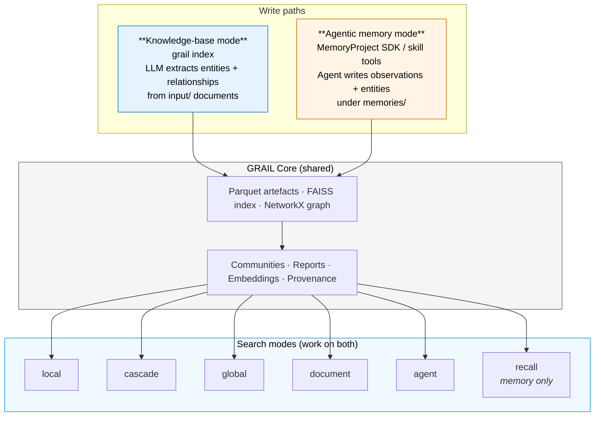
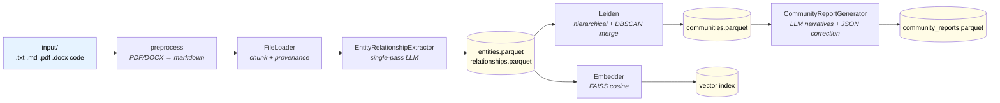
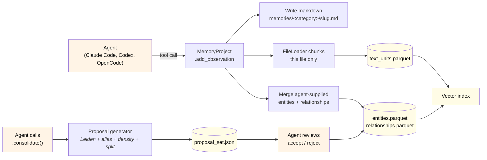
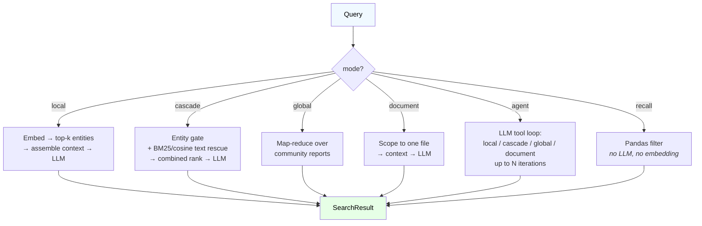

<p align="center">
  
</p>

<p align="center">
  <strong>One graph engine, two write paths: a queryable knowledge base over your documents, and an agentic memory layer for Claude Code, Codex, and OpenCode.</strong>
</p>

<p align="center">
  <sub><em>Vectors:</em> FAISS · LanceDB · ChromaDB &nbsp;|&nbsp; <em>Storage:</em> Local · S3 &nbsp;|&nbsp; <em>LLM endpoints:</em> OpenAI · Anthropic · DeepInfra · Together · Groq · OpenRouter · Ollama · vLLM · SGLang · LM Studio</sub>
</p>

<p align="center">
  <a href="#installation">Install</a> ·
  <a href="#quickstart">Quickstart</a> ·
  <a href="#two-modes-one-engine">Modes</a> ·
  <a href="#cli-reference">CLI</a> ·
  <a href="#python-sdk">SDK</a> ·
  <a href="#storage--vector-backends">Backends</a> ·
  <a href="#benchmarks">Benchmarks</a> ·
  <a href="https://github.com/CAMARA-CHILENA-INTELIGENCIA-ARTIFICIAL/GRAIL/blob/master/docs/getting-started.md">Docs</a>
</p>

<p align="center">
  <em>🇬🇧 English · <a href="https://github.com/CAMARA-CHILENA-INTELIGENCIA-ARTIFICIAL/GRAIL/blob/master/README.es.md">🇪🇸 Español</a></em>
</p>

---

## Table of contents

1. [What is GRAIL](#what-is-grail)
2. [Two modes, one engine](#two-modes-one-engine)
3. [Why GRAIL](#why-grail)
4. [How it works](#how-it-works)
5. [Installation](#installation)
6. [Quickstart](#quickstart)
7. [Python SDK](#python-sdk)
8. [Agent skill](#agent-skill)
9. [CLI reference](#cli-reference)
10. [Search modes](#search-modes)
11. [Storage & vector backends](#storage--vector-backends)
12. [Benchmarks](#benchmarks)
13. [Documentation](#documentation)
14. [Acknowledgements](#acknowledgements)
15. [Author](#author)
16. [License](#license)

---

## What is GRAIL

**GRAIL** (Graph RAG with Advanced Integrations and Learning) is an open-source Python framework that turns text into a queryable knowledge graph — and serves it back through six retrieval modes, including an agentic search loop and a structural recall mode.

What makes GRAIL different from other GraphRAG systems is that the same engine powers **two completely different use cases** through the same artefacts (parquet + FAISS + NetworkX):

- **Knowledge-base mode** — point it at a folder of documents, run `grail index`, query through any of six search modes. Like vanilla GraphRAG, but with cascade retrieval, agentic search, incremental updates, and honest cost tracking.
- **Agentic memory mode** — embed GRAIL inside an agent (Claude Code, Codex, OpenCode, or any framework that supports the skill format) and let it write observations, entities, and relationships directly. The agent owns the write path; GRAIL keeps the graph coherent and searchable. A ready-to-install [agent skill](#agent-skill) ships with the repo.

Both modes share one schema, one storage layer, and the same five search modes — plus a memory-only `recall` mode that runs without any LLM call. You can run both write paths against the same project simultaneously.

GRAIL ships with provider-agnostic endpoints: OpenAI, Anthropic, DeepInfra, Together, Groq, OpenRouter, Ollama, vLLM, SGLang, and LM Studio are first-class. Swap providers with a one-line config change.

---

## Two modes, one engine



### When to use which

| You want to… | Use mode | Entry point |
|---|---|---|
| Build a Q&A bot over a document corpus | `knowledge_base` | `grail init my-kb` |
| Embed long-term memory in a coding agent (Claude Code, Codex, OpenCode) | `memory` | `grail init my-mem --memory` |
| Mix both — agent writes memories *and* you index reference docs | both | `grail init my-mixed --memory` then drop docs into `input/` and run `grail index` |

The contract is binding: **everything that works in knowledge-base mode works in memory mode** — same parquets, same search code. Only the write path differs.

---

## Why GRAIL

| Capability | What it means | Where it lives |
|---|---|---|
| **Two write paths, one schema** | Knowledge-base mode and agentic memory mode produce the same parquet artefacts. Every search mode works on either. | `grail/core.py`, `grail/memory/project.py` |
| **Agent-driven writes** | `MemoryProject.add_observation(...)` lets agents persist memories with explicit entities and relationships. No LLM extraction step — the caller already knows what they meant. | `grail/memory/project.py:190` |
| **Folders as communities** | In memory mode, the folder path under `memories/` (e.g. `work/clients/acme/`) declares the entity's community. Multi-membership is first-class. | `grail/memory/project.py` |
| **`consolidate()` as a proposal generator** | Runs Leiden + edge-density + alias-detection + folder-split analyses and emits a structured proposal file. The agent reviews; nothing mutates without consent. | `grail/memory/consolidate.py`, `grail/memory/analyses/` |
| **Cascade search** | Hybrid entity-gate + BM25/cosine text rescue. Recovers facts that live in chunks where no entity was extracted. | `grail/query/cascade_search.py` |
| **Agent search** | LLM-driven tool-calling loop that picks between local / cascade / global / document per question, with forced-synthesis fallback. | `grail/query/agent.py` |
| **Recall mode** | Pure pandas filter over `observed_at` / `category` / `tag` / `entity` / `confidence` — zero LLM, zero embedding. Built for memory replay. | `grail/query/recall_search.py`, `grail/query/recall_filter.py` |
| **Incremental updates** | `append` / `edit` / `delete` re-extract only affected text units. A change-ratio scheduler (threshold 0.3) updates communities without a full rebuild. | `grail/indexing/incremental_community.py` |
| **Single-pass extraction (KB mode)** | Entities + relationships + descriptions + 2–3 anticipated retrieval queries in one LLM call per chunk — significantly fewer round-trips than systems that run separate passes. | `grail/indexing/entities_relationships.py` |
| **Retrieval queries on entities** | Each entity stores 2–3 anticipated user questions in its embedding text. Improves cross-lingual and intent-based matching. | `grail/indexing/entities_relationships.py` |
| **Typed relationships** | Optional LLM classification of edges (`REGULATES`, `FUNDS`, …). Three modes: disabled, free, constrained vocabulary. | `grail/config.py:IndexingConfig` |
| **File-level provenance** | Every text unit retains back-pointers to source files. Citations reference real documents. | `grail/indexing/loader.py` |
| **Honest cost tracking** | Distinguishes `complete` / `partial` / `undefined` pricing. Never reports a fake `$0.00` when pricing is unknown. | `grail/llm/cost.py` |
| **Unified `Reply` envelope** | Every `MemoryProject` method returns `Reply(ok, data, warnings, next_steps, error)` — same contract for the SDK and the agent-skill scripts. | `grail/memory/types.py` |
| **Multi-backend storage & vectors** | Local or S3 storage; FAISS (default cosine), LanceDB, or ChromaDB vectors. | `grail/storage/`, `grail/vectorstores/` |
| **Two reference UIs** | Textual terminal chat and FastAPI + React web chat — both embed GRAIL as a library. | `grail/apps/cli_chat/`, `grail/apps/chat/` |

---

## How it works

### Knowledge-base indexing pipeline

<p align="center">
  
</p>



### Memory-mode write path

<p align="center">
  
</p>



### Query flow (works on both modes)



---

## Installation

```bash
git clone git@github.com:CAMARA-CHILENA-INTELIGENCIA-ARTIFICIAL/GRAIL.git
cd GRAIL

# Recommended: uv (https://github.com/astral-sh/uv)
uv venv --python 3.12
uv pip install -e ".[dev]"          # add ",s3" for S3, ",ui" for the web chat

# Or plain pip
python3.12 -m venv .venv && source .venv/bin/activate
pip install -e ".[dev]"
```

Set the API keys for whichever endpoint(s) you use:

```bash
cp .env.example .env
# edit .env — OPENAI_API_KEY, DEEPINFRA_API_KEY, ANTHROPIC_API_KEY, …
```

Built-in endpoints cover `openai`, `anthropic`, `deepinfra`, `together`, `groq`, `openrouter`, `ollama`, `vllm`, `sglang`, `lmstudio`, `local`. Add your own:

```yaml
# endpoints.yaml
endpoints:
  my-vllm:
    base_url: http://my-vllm.local:8000/v1
    api_key_env: MY_VLLM_KEY
    requires_key: false
```

---

## Quickstart

### Knowledge-base mode

```bash
# 1. Scaffold a project (low_cost_setup pre-tunes DeepInfra-friendly defaults)
uv run grail init ./my-kb --name my-kb --template low_cost_setup

# 2. Drop .txt / .md / .pdf / .docx / code files into ./my-kb/input/

# 3. Index
uv run grail index ./my-kb
```

> 📸 *Place `assets/indexing.png` here — terminal output from the four-step indexing run.*

```bash
# 4. Query — six modes
uv run grail query ./my-kb "What are the main themes?"           --mode global
uv run grail query ./my-kb "Who is Alice?"                       --mode local
uv run grail query ./my-kb "What dosage does protocol X cite?"   --mode cascade
uv run grail query ./my-kb "Summarise law-21250.pdf"             --mode document -d law-21250.pdf
uv run grail query ./my-kb "Compare early vs advanced treatment." --mode agent

# 5. Chat with it
uv run grail chat ./my-kb              # Textual TUI
uv run grail ui   ./my-kb              # FastAPI + React, http://127.0.0.1:8765
```

> 📸 *Place `assets/query.png` here — formatted answer with cited context.*
> 📸 *Place `assets/chat_ui.png` here — web chat with streaming responses.*

### Agentic memory mode

```bash
# 1. Scaffold a memory project
uv run grail init ./my-mem --memory

# 2. Drive it from your agent (Python SDK example below). The agent writes
#    markdown observations under ./my-mem/memories/<category>/ and entities
#    are merged into the parquet on every write.

# 3. Recall — pure pandas filter, no LLM
uv run grail query ./my-mem --mode recall --since 7d --tag "decision"
uv run grail query ./my-mem --mode recall --category "work/clients/acme/**"

# 4. Cascade with a memory filter — combine semantic search and structural scope
uv run grail query ./my-mem "What did we decide about the migration?" \
  --mode cascade --since 30d --tag "decision"

# 5. Consolidate — generate proposals (merge aliases, discover communities, …)
uv run grail consolidate ./my-mem
uv run grail proposals list  ./my-mem
uv run grail proposals apply ./my-mem --accept <proposal_id>
```

> 📸 *Place `assets/memory_consolidate.png` here — proposals listing output.*

---

## Python SDK

GRAIL is library-first. The CLI is just a wrapper around the same Python API.

### Knowledge-base mode

```python
import asyncio
from grail import GRAIL, load_config

async def main():
    grail = GRAIL.from_config(load_config("./my-kb"))

    # Full pipeline.
    await grail.index()

    # Six search modes return the same SearchResult shape.
    answer = await grail.search("What are the main themes?", mode="global")
    print(answer.response)

    answer = await grail.agent_search("Compare early vs advanced treatment.")
    print(answer.response)

    # Incremental updates touch only affected text units.
    await grail.append(["new_doc.pdf"])
    await grail.edit({"existing.md": "/path/to/updated.md"})
    await grail.delete(["obsolete.txt"])

    # Honest cost ledger.
    print(grail.cost_tracker.render_total_cost())

asyncio.run(main())
```

### Agentic memory mode

```python
import asyncio
from grail import MemoryProject

async def main():
    mp = MemoryProject("./my-mem")

    # The agent writes an observation with explicit entities + relationships.
    # No LLM extraction — the caller already knows what they meant.
    reply = await mp.add_observation(
        title="Acme picked Postgres over DynamoDB",
        content="In the architecture review on Tuesday, Acme committed to "
                "Postgres for the order-history service because of "
                "transactional needs across the inventory + payments tables.",
        category="work/clients/acme",
        tags=["decision", "architecture"],
        entities=[
            {"name": "Acme",     "type": "ORGANIZATION", "description": "Client"},
            {"name": "Postgres", "type": "TECHNOLOGY",   "description": "Chosen DB"},
            {"name": "DynamoDB", "type": "TECHNOLOGY",   "description": "Rejected alternative"},
        ],
        relationships=[
            {"source": "Acme", "target": "Postgres", "relationship_type": "CHOSE",
             "description": "for transactional order-history"},
            {"source": "Acme", "target": "DynamoDB", "relationship_type": "REJECTED",
             "description": "lacked cross-table transactions"},
        ],
        confidence=0.95,
    )
    print(reply.ok, reply.data["observation_id"])

    # Recall — no LLM, structural filter only.
    recall = await mp.recall(
        mode="recall",
        category="work/clients/acme/**",
        tags=["decision"],
        since="30d",
    )
    for obs in recall.data["observations"]:
        print(obs["observed_at"], obs["title"])

    # Cascade with the same filter, so semantic search is scoped to recent
    # Acme decisions.
    answer = await mp.recall(
        "Why did Acme rule out DynamoDB?",
        mode="cascade",
        category="work/clients/acme/**",
        since="30d",
    )
    print(answer.data["response"])

    # Consolidate — runs proposal analyses; the agent reviews each item.
    proposals = mp.consolidate()
    for p in proposals.data.get("proposals", []):
        print(p["kind"], p["confidence"], p["rationale"])

asyncio.run(main())
```

Every `MemoryProject` method returns a `Reply(ok, data, warnings, next_steps, error)` envelope — the same shape the agent-skill scripts emit, so SDK callers and tool-calling agents read the same keys.

The memory SDK is designed to be wrapped by agent skills (`SKILL.md` folder format) that run inside **Claude Code**, **OpenAI Codex**, **OpenCode**, or any other framework that supports the standard skill convention. Discovery paths differ per framework; the skill body itself is portable.

See [`docs/python_api.md`](https://github.com/CAMARA-CHILENA-INTELIGENCIA-ARTIFICIAL/GRAIL/blob/master/docs/python_api.md), the runnable [`examples/quickstart/quickstart.py`](https://github.com/CAMARA-CHILENA-INTELIGENCIA-ARTIFICIAL/GRAIL/blob/master/examples/quickstart/quickstart.py), and the canonical embedding reference at [`grail/apps/chat/server.py`](https://github.com/CAMARA-CHILENA-INTELIGENCIA-ARTIFICIAL/GRAIL/blob/master/grail/apps/chat/server.py).

---

## Agent skill

GRAIL ships as a **portable agent skill** under [`skills/grail/`](https://github.com/CAMARA-CHILENA-INTELIGENCIA-ARTIFICIAL/GRAIL/tree/master/skills/grail) that lets a coding agent drive a knowledge base or maintain its own memory directly through tool calls — no Python harness on the agent side.

The skill follows the standard `SKILL.md` folder convention shared across **Claude Code**, **OpenAI Codex**, and other frameworks that adopt the same skill format, so the same folder works everywhere with framework-specific install paths.

### What's inside

```
skills/grail/
├── SKILL.md              ← skill description + agent-facing trigger language
├── INSTALL.md            ← per-framework install paths
├── requirements.txt
├── scripts/              ← one CLI script per primitive operation
│   ├── setup.sh          ← idempotent: installs grail on first call
│   ├── init_project.py
│   ├── list_grail_projects.py
│   ├── status.py
│   ├── index.py · append.py · edit.py · delete.py · explore.py · query.py · env_check.py
│   └── memory/                   ← memory-mode tools
│       ├── add_observation.py
│       ├── add_entity.py · add_relationship.py · add_community.py
│       ├── find_similar_entity.py
│       ├── recall.py
│       ├── consolidate.py · list_proposals.py · apply_proposal.py
├── agents/openai.yaml    ← Codex sidecar (additive metadata)
├── references/           ← long-form context the agent reads on demand
│   ├── kb_mode.md · memory_mode.md · memory_tools.md
│   ├── proposals.md · search_modes.md · query_optimization.md
│   └── config_reference.md · troubleshooting.md
└── assets/
```

### Install

```bash
# Claude Code — user scope (symlink so `git pull` updates the skill)
mkdir -p ~/.claude/skills
ln -s "$(pwd)/skills/grail" ~/.claude/skills/grail

# OpenAI Codex — user scope
mkdir -p ~/.agents/skills
ln -s "$(pwd)/skills/grail" ~/.agents/skills/grail

# Project scope — bundle the skill inside a repo where you want it auto-discovered
mkdir -p .claude/skills
ln -s "$(realpath skills/grail)" .claude/skills/grail
```

| Framework | User-scope install | Project-scope install |
|---|---|---|
| Claude Code (CLI + claude.ai) | `~/.claude/skills/grail/` | `<repo>/.claude/skills/grail/` |
| OpenAI Codex | `~/.agents/skills/grail/` | `<repo>/.agents/skills/grail/` |
| Other frameworks supporting `SKILL.md` | framework-specific skills directory | same |

The skill auto-installs GRAIL via `scripts/setup.sh` on first call. It is idempotent — safe to invoke every session. See [`skills/grail/INSTALL.md`](https://github.com/CAMARA-CHILENA-INTELIGENCIA-ARTIFICIAL/GRAIL/blob/master/skills/grail/INSTALL.md) for full details, including how to verify the install (`scripts/env_check.py`).

### How an agent uses it

Every primitive is a single CLI script that returns a JSON `Reply` envelope (`{ok, data, warnings, next_steps, error}`) — the same shape the Python SDK uses, so the agent reads identical keys regardless of how it invokes GRAIL.

A typical memory-mode session inside the agent:

```bash
python scripts/list_grail_projects.py
# → which projects exist, their mode (knowledge_base or memory)

python scripts/status.py --project my-mem
# → mode, artefact counts, last_indexed_at; the agent routes on `mode`

python scripts/memory/add_observation.py \
  --project my-mem \
  --title "Acme picked Postgres over DynamoDB" \
  --content "..." \
  --category "work/clients/acme" \
  --tag decision --tag architecture \
  --entities '[{"name":"Acme","type":"ORGANIZATION"},{"name":"Postgres","type":"TECHNOLOGY"}]' \
  --relationships '[{"source":"Acme","target":"Postgres","relationship_type":"CHOSE"}]'

python scripts/memory/recall.py --project my-mem --since 7d --tag decision

python scripts/memory/consolidate.py     --project my-mem
python scripts/memory/list_proposals.py  --project my-mem
python scripts/memory/apply_proposal.py  --project my-mem --accept <proposal_id>
```

The skill body (the `SKILL.md` description, references, and scripts) is fully portable across frameworks; only the discovery path differs per framework. See [`skills/grail/SKILL.md`](https://github.com/CAMARA-CHILENA-INTELIGENCIA-ARTIFICIAL/GRAIL/blob/master/skills/grail/SKILL.md) for the agent-facing trigger language and routing logic.

---

## CLI reference

All commands take a project directory as the first positional argument.

### `grail init` — scaffold a project

```bash
grail init <project_dir> [--name NAME] [--memory]
                         [--template TEMPLATE] [--templates-dir DIR]
                         [--overwrite] [--git/--no-git] [--list-templates]
```

| Flag | Description |
|---|---|
| `--memory` | **Scaffold a memory-mode project** (`memories/` folder, agent-driven write path). Default is `knowledge_base` mode (`input/` folder, `grail index` workflow). |
| `--name` | Project name (defaults to directory name). |
| `--template`, `-t` | Template pack (e.g. `low_cost_setup`) or your own under `--templates-dir`. Mutually exclusive with `--memory`. |
| `--templates-dir` | Extra directory to search for templates. |
| `--overwrite` | Overwrite an existing scaffold. |
| `--git/--no-git` | Initialise a git repo. Default: **on** for memory mode, off for KB mode. |
| `--list-templates` | List available templates and exit. |

### `grail index` — full pipeline (KB mode)

```bash
grail index <project_dir> [--discover-entities/--no-discover-entities]
                          [--vectorstore lancedb|faiss|chromadb]
```

### `grail query` — answer a question

```bash
grail query <project_dir> "<question>" [--mode MODE] [--document NAME]
                                       [--rerank/--no-rerank] [--trace DIR]
                                       [--output text|json]
                                       [--vectorstore lancedb|faiss|chromadb]
                                       # memory recall filters:
                                       [--since DELTA] [--before DELTA]
                                       [--category GLOB] [--tag TAG ...]
                                       [--entity-name NAME ...] [--type TYPE ...]
                                       [--min-confidence FLOAT]
```

| Flag | Description |
|---|---|
| `--mode`, `-m` | `local` (default) · `cascade` · `global` · `document` · `agent` · `recall`. |
| `--document`, `-d` | Required for `--mode document`. |
| `--rerank/--no-rerank` | Override the reranker config for this query. |
| `--trace`, `-t` | Dump full prompts, responses, and context to JSON. |
| `--since` / `--before` | Restrict to observations newer/older than ISO-8601 timestamp or relative (`1h`, `7d`). |
| `--category` | Folder-glob filter (e.g. `work/clients/**`). |
| `--tag` | Tag filter; repeat for any-match. |
| `--entity-name`, `--type` | Restrict candidate pool to specific entities or types. |
| `--min-confidence` | Drop entities / text units below this confidence. |

### `grail append` / `edit` / `delete` — incremental KB updates

```bash
grail append <project_dir> file1 [file2 ...]
grail edit   <project_dir> --name FILENAME --src /path/to/new
grail delete <project_dir> filename1 [filename2 ...]
```

### `grail consolidate` — generate memory proposals

Runs Leiden + edge-density + alias-detection + folder-split analyses and writes a proposal set. Pure read pass — **nothing mutates** until the agent reviews.

```bash
grail consolidate <project_dir> [--output text|json]
```

### `grail proposals list` / `grail proposals apply`

```bash
grail proposals list  <project_dir> [--status pending|accepted|rejected]
grail proposals apply <project_dir> [--accept ID] [--reject ID]
```

### `grail create-entities` — LLM entity-type discovery (KB mode)

```bash
grail create-entities <project_dir> [--write]
```

### `grail chat` / `grail ui` — interactive interfaces

```bash
grail chat <project_dir> [--mode agent|local|cascade|global|document]
                         [--session ID] [--db PATH]

grail ui   <project_dir> [--host HOST] [--port PORT] [--dev] [--debug]
```

### `grail viz` / `grail explore` / `grail export-neo4j`

```bash
grail viz          <project_dir> [--output FILE.html] [--open-browser]
                                 [--layout-seed N] [--layout-iterations N]
grail explore      <project_dir> [--output text|json]
grail export-neo4j <project_dir> [--uri URI] [--username USER] [--password PW]
                                 [--database DB] [--clear] [--no-apoc]
                                 [--batch-size N]
```

### `grail status` / `grail config show` / `grail prompt list` / `grail prompt show`

Introspection commands for artefacts, resolved config, and the prompt registry.

---

## Search modes

| Mode | Best for | How it works | LLM? |
|---|---|---|---|
| `local` | Named concepts, entities, "who/what is X" | Embed query → top-k similar entities → assemble linked text units, relationships, reports → answer. | Yes |
| `cascade` | Factual questions, specific details | Entity-gate + BM25/cosine text rescue → combined ranking → answer. Solves the classic GraphRAG fact-retrieval gap. | Yes |
| `global` | Broad / thematic questions | Map-reduce over community reports; hierarchical reduce above 100K tokens. | Yes |
| `document` | Single-file questions | Scope retrieval to one source document. | Yes |
| `agent` | Multi-step / comparative questions | LLM picks 1–3 of the above per question, with forced synthesis if iterations run out. | Yes |
| `recall` | Memory replay, "what did we say last week about X" | Pure pandas filter over `observed_at` / `category` / `tag` / `entity` / `confidence`. **Zero LLM cost.** Combine with any other mode as a filter modifier. | **No** |

**Query-shape tip for `local` / `cascade`:** structure as `[WHO does it] + [WHAT is the process] + [SPECIFIC TERMS from entity descriptions]`. This matches entity embeddings ~3× better than keyword-only queries.

Full details: [`docs/search_modes.md`](https://github.com/CAMARA-CHILENA-INTELIGENCIA-ARTIFICIAL/GRAIL/blob/master/docs/search_modes.md).

---

## Storage & vector backends

Both layers are pluggable. Pick the defaults to ship today and swap when the deployment changes.

### Vector stores

| Backend | Default? | Distance | Best for | Config |
|---|---|---|---|---|
| **FAISS** | ✓ | cosine (`IndexFlatIP` on L2-normalised vectors) | In-memory speed; ships in the wheel; no separate service; ideal for projects up to ~1M vectors | `vectorstore.backend: faiss` |
| **LanceDB** | | cosine / L2 | On-disk columnar; lazy-loaded; good for >1M vectors and multi-process readers | `vectorstore.backend: lancedb` |
| **ChromaDB** | | cosine / L2 | Long-running services; built-in metadata filtering; existing Chroma deployments | `vectorstore.backend: chromadb` |

Override per-run from the CLI without editing config: `grail index --vectorstore faiss|lancedb|chromadb` and the same flag on `grail query`. Custom backends plug in by subclassing `BaseVectorStore` in [`grail/vectorstores/base.py`](https://github.com/CAMARA-CHILENA-INTELIGENCIA-ARTIFICIAL/GRAIL/blob/master/grail/vectorstores/base.py).

Details: [`docs/vectorstores.md`](https://github.com/CAMARA-CHILENA-INTELIGENCIA-ARTIFICIAL/GRAIL/blob/master/docs/vectorstores.md).

### Storage backends

| Backend | Best for | Config |
|---|---|---|
| **Local filesystem** | Default · single machine · tests · embedded CLI | `storage.backend: local`, `storage.root: ...` |
| **S3 (and S3-compatible)** | Production · multi-machine · MinIO · Cloudflare R2 · any S3 API | `storage.backend: s3` + `s3_bucket`, `s3_prefix`, `s3_region`, `s3_endpoint_url` |

S3 reads/writes the same parquet + GraphML artefacts — the search code is backend-agnostic. Install with the `s3` extra: `uv pip install -e ".[s3]"`. Custom backends implement the seven required methods on `StorageBackend` in [`grail/storage/base.py`](https://github.com/CAMARA-CHILENA-INTELIGENCIA-ARTIFICIAL/GRAIL/blob/master/grail/storage/base.py).

Details: [`docs/storage.md`](https://github.com/CAMARA-CHILENA-INTELIGENCIA-ARTIFICIAL/GRAIL/blob/master/docs/storage.md).

### LLM endpoints

Built-in: `openai`, `anthropic`, `deepinfra`, `together`, `groq`, `openrouter`, `ollama`, `vllm`, `sglang`, `lmstudio`, `local`. Endpoint (base URL + key env var) and model are separate fields, so changing providers is a one-line config edit. Add your own by appending to `endpoints.yaml`:

```yaml
endpoints:
  my-vllm:
    base_url: http://my-vllm.local:8000/v1
    api_key_env: MY_VLLM_KEY
    requires_key: false
```

Details: [`docs/llm.md`](https://github.com/CAMARA-CHILENA-INTELIGENCIA-ARTIFICIAL/GRAIL/blob/master/docs/llm.md).

---

## Benchmarks

### Internal: Chilean Oncology Laws (`benchmark_laws`)

30 patient-language questions across 7 categories against three Chilean oncology laws (~58 pages, 35 chunks). Designed as a **worst-case scenario for graph-enhanced retrieval** — a corpus small enough that vanilla RAG has no retrieval failures.

| Metric | **GRAIL Agent** | RAG Agent |
|---|---|---|
| Average score (5-dim rubric) | **4.80 / 5.00** | 4.14 / 5.00 |
| Win – Loss – Tie | **27 – 0 – 3** | 0 – 27 – 3 |
| Avg response time | ~25 s | ~35 s |
| Avg LLM calls per question | 2.6 | 3.1 |
| Empty responses | 0 | 0 |

Where the advantage comes from:

| Category | Δ score | Why |
|---|---|---|
| Cross-Source (answer spans documents) | **+0.80** | Graph links across documents. |
| Comparative | **+0.80** | Agent runs two `local_search` calls in parallel. |
| Global Synthesis | **+0.90** | Community reports give bird's-eye context. |
| Multi-Chunk | +0.72 | Entity graph connects chunks. |
| Procedural | +0.64 | Relationship chains preserve step order. |
| Single Fact | +0.52 | Entity descriptions answer directly. |
| Negation / Boundary | +0.08 | Near tie. |

**Methodology:** Qwen3.6-35B-A3B (DeepInfra) for inference, Qwen3-Embedding-8B for retrieval, FAISS cosine, 3-iteration agent budget, Claude Opus 4.6 judge with a 5-dimension rubric (Correctness 35%, Completeness 25%, Source Grounding 15%, Coherence 10%, No Hallucination 15%).

```bash
uv run python benchmarks/run_benchmark.py
```

> 📸 *Place `assets/benchmark_chart.png` here — bar chart of GRAIL vs RAG by category.*

Full report and per-question detail: [`benchmarks/results/`](https://github.com/CAMARA-CHILENA-INTELIGENCIA-ARTIFICIAL/GRAIL/tree/master/benchmarks/results).

### External (roadmap)

- **[GraphRAG-Bench](https://arxiv.org/abs/2506.05690)** — 4,072 questions, Medical + Novel domains, 4 difficulty levels.
- **[LongMemEval](https://arxiv.org/abs/2410.10813)** — 500 questions on chat-session memory; tracked under memory mode.

See [`docs/benchmarks.md`](https://github.com/CAMARA-CHILENA-INTELIGENCIA-ARTIFICIAL/GRAIL/blob/master/docs/benchmarks.md).

---

## Documentation

| Topic | File |
|---|---|
| Getting started | [`docs/getting-started.md`](https://github.com/CAMARA-CHILENA-INTELIGENCIA-ARTIFICIAL/GRAIL/blob/master/docs/getting-started.md) |
| Python API | [`docs/python_api.md`](https://github.com/CAMARA-CHILENA-INTELIGENCIA-ARTIFICIAL/GRAIL/blob/master/docs/python_api.md) |
| Config glossary | [`docs/glossary.md`](https://github.com/CAMARA-CHILENA-INTELIGENCIA-ARTIFICIAL/GRAIL/blob/master/docs/glossary.md) |
| Search modes | [`docs/search_modes.md`](https://github.com/CAMARA-CHILENA-INTELIGENCIA-ARTIFICIAL/GRAIL/blob/master/docs/search_modes.md) |
| Indexing pipeline | [`docs/indexing.md`](https://github.com/CAMARA-CHILENA-INTELIGENCIA-ARTIFICIAL/GRAIL/blob/master/docs/indexing.md) |
| Incremental updates | [`docs/incremental_pipeline.md`](https://github.com/CAMARA-CHILENA-INTELIGENCIA-ARTIFICIAL/GRAIL/blob/master/docs/incremental_pipeline.md) |
| Query layer | [`docs/query.md`](https://github.com/CAMARA-CHILENA-INTELIGENCIA-ARTIFICIAL/GRAIL/blob/master/docs/query.md) |
| Prompt customisation | [`docs/prompt_customization.md`](https://github.com/CAMARA-CHILENA-INTELIGENCIA-ARTIFICIAL/GRAIL/blob/master/docs/prompt_customization.md) |
| Prompt internals | [`docs/prompts.md`](https://github.com/CAMARA-CHILENA-INTELIGENCIA-ARTIFICIAL/GRAIL/blob/master/docs/prompts.md) |
| LLM & cost tracking | [`docs/llm.md`](https://github.com/CAMARA-CHILENA-INTELIGENCIA-ARTIFICIAL/GRAIL/blob/master/docs/llm.md) |
| Reranker | [`docs/reranker.md`](https://github.com/CAMARA-CHILENA-INTELIGENCIA-ARTIFICIAL/GRAIL/blob/master/docs/reranker.md) |
| Vector stores | [`docs/vectorstores.md`](https://github.com/CAMARA-CHILENA-INTELIGENCIA-ARTIFICIAL/GRAIL/blob/master/docs/vectorstores.md) |
| Storage backends | [`docs/storage.md`](https://github.com/CAMARA-CHILENA-INTELIGENCIA-ARTIFICIAL/GRAIL/blob/master/docs/storage.md) |
| Preprocessing (PDF/DOCX) | [`docs/preprocessing.md`](https://github.com/CAMARA-CHILENA-INTELIGENCIA-ARTIFICIAL/GRAIL/blob/master/docs/preprocessing.md) |
| Visualisation | [`docs/viz.md`](https://github.com/CAMARA-CHILENA-INTELIGENCIA-ARTIFICIAL/GRAIL/blob/master/docs/viz.md) |
| Chat UIs | [`docs/cli_chat.md`](https://github.com/CAMARA-CHILENA-INTELIGENCIA-ARTIFICIAL/GRAIL/blob/master/docs/cli_chat.md) |
| Benchmarks | [`docs/benchmarks.md`](https://github.com/CAMARA-CHILENA-INTELIGENCIA-ARTIFICIAL/GRAIL/blob/master/docs/benchmarks.md) |
| Comparison vs alternatives | [`docs/comparison.md`](https://github.com/CAMARA-CHILENA-INTELIGENCIA-ARTIFICIAL/GRAIL/blob/master/docs/comparison.md) |

A Docusaurus site is in progress; this README and the files above are the current source of truth.

---

## Acknowledgements

- The single-pass LLM extraction of entities and relationships from text chunks in GRAIL's knowledge-base mode draws inspiration from [**Microsoft GraphRAG**](https://github.com/microsoft/graphrag).
- Nirvai, partner of CCHIA for the code base and testing results on agentic memory.

GRAIL is developed under the open-source commission of the **[Cámara Chilena de Inteligencia Artificial](https://cchia.cl)** (Chilean Chamber of Artificial Intelligence).

---

## Author

**Benjamín González Guerrero** — Founder at [**Nirvai (Nirvana)**](https://nirvana-ai.com).
Contact: [ben@nirvana-ai.com](mailto:ben@nirvana-ai.com)

GRAIL is shipped under the Nirvai (Nirvana) umbrella.

---

## License

[MIT](https://github.com/CAMARA-CHILENA-INTELIGENCIA-ARTIFICIAL/GRAIL/blob/master/LICENSE) © 2025 Cámara Chilena de Inteligencia Artificial.
