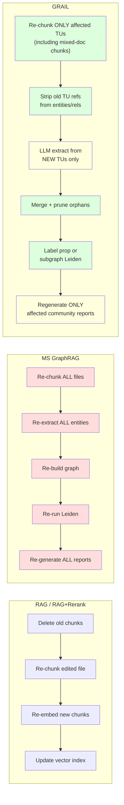
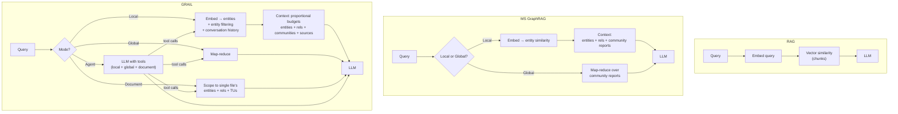

"""
Provided by Nirvai (Nirvana). Author: Benjamin González Guerrero.
"""

# RAG Approaches Compared

This document compares five retrieval-augmented generation architectures, from
the simplest (vanilla RAG) to the most complete (GRAIL).

> ✅ = native support &nbsp;&nbsp; 🟡 = partial / requires custom work &nbsp;&nbsp; ❌ = not supported

---

## What Each Architecture Is

### RAG (Vanilla)

The baseline. Chunk documents, embed chunks, store in a vector database.
At query time, embed the query, retrieve top-k chunks by cosine similarity,
concatenate them into a prompt, and ask the LLM. No structure, no relationships,
no global view.

### RAG + Reranking

Same as vanilla RAG, but after the initial vector retrieval, a cross-encoder
reranker (e.g. Cohere Rerank, `ms-marco-MiniLM`) re-scores the candidates. This
improves precision by trading recall for relevance — the reranker sees the full
query-document pair, not just embeddings.

### Graph RAG (Generic)

A broad category: any system that builds a graph (entities + relationships)
from documents and uses graph structure during retrieval. Implementations vary
widely. Some use knowledge-graph triples (subject-predicate-object), others use
LLM-extracted entity-relationship pairs. Retrieval may traverse the graph,
expand neighbors, or embed subgraphs.

### Microsoft GraphRAG

The specific open-source implementation from Microsoft Research. Key
innovations: hierarchical Leiden community detection on the entity-relationship
graph, community summarization via LLM, and a map-reduce global search over
community reports. GRAIL is a hardened fork of this approach.

### GRAIL

GRAIL (Graph RAG with Advanced Integration and Learning) extends Microsoft
GraphRAG with file-level provenance tracking, incremental graph updates
(append/edit/delete), document-scoped search, agentic multi-tool search, mixed-
document chunking, and production-hardened error recovery. It's designed for
knowledge bases that change over time, not just static corpora.

---

## Master Comparison

### Core Architecture

| Capability | RAG | RAG + Rerank | Graph RAG | MS GraphRAG | GRAIL |
|:-----------|:---:|:----------:|:---------:|:----------:|:-----:|
| Chunk documents into text units | ✅ | ✅ | 🟡 | ✅ | ✅ |
| Embed chunks for vector search | ✅ | ✅ | 🟡 | ✅ | ✅ |
| Extract entities from text (LLM) | ❌ | ❌ | ✅ | ✅ | ✅ |
| Extract relationships from text (LLM) | ❌ | ❌ | 🟡 | ✅ | ✅ |
| Build entity-relationship graph | ❌ | ❌ | ✅ | ✅ | ✅ |
| Community detection (Leiden clustering) | ❌ | ❌ | ❌ | ✅ | ✅ |
| Small-community merge (DBSCAN on embeddings) | ❌ | ❌ | ❌ | ❌ | ✅ |
| Community summarization (LLM reports) | ❌ | ❌ | ❌ | ✅ | ✅ |
| 3-pass JSON repair for LLM output | ❌ | ❌ | ❌ | 🟡 | ✅ |
| Reranking | ❌ | ✅ | ❌ | ❌ | 🟡 |
| Multi-description entity summarization | ❌ | ❌ | ❌ | ✅ | ✅ |
| Entity dedup by name (case-insensitive) | ❌ | ❌ | 🟡 | ✅ | ✅ |
| LLM-driven entity type discovery | ❌ | ❌ | ❌ | ❌ | ✅ |
| Mixed-document chunking | ❌ | ❌ | ❌ | ❌ | ✅ |

### Knowledge Provenance & Source Tracking

| Capability | RAG | RAG + Rerank | Graph RAG | MS GraphRAG | GRAIL |
|:-----------|:---:|:----------:|:---------:|:----------:|:-----:|
| Chunk → source file tracking | 🟡 | 🟡 | 🟡 | ❌ | ✅ |
| Entity → source file tracking | ❌ | ❌ | ❌ | ❌ | ✅ |
| Relationship → source file tracking | ❌ | ❌ | ❌ | ❌ | ✅ |
| `text_unit_ids` on every entity/rel | ❌ | ❌ | ❌ | ❌ | ✅ |
| `document_ids` on every text unit | ❌ | ❌ | ❌ | ❌ | ✅ |
| `mapping.json` (doc ID → original path) | ❌ | ❌ | ❌ | ❌ | ✅ |
| Citation by actual filename in answers | ❌ | ❌ | ❌ | ❌ | ✅ |
| Mixed-document chunk provenance | ❌ | ❌ | ❌ | ❌ | ✅ |
| Full provenance chain (entity → TU → doc → file) | ❌ | ❌ | ❌ | ❌ | ✅ |

**The provenance chain** is the core innovation that makes incremental updates
and document search possible:

```
Entity "EINSTEIN"
  └─ text_unit_ids: [tu_1, tu_5]
       └─ tu_1.document_ids: [doc_A]
            └─ mapping[doc_A].original_path: "papers/relativity.pdf"
       └─ tu_5.document_ids: [doc_B]
            └─ mapping[doc_B].original_path: "biographies/einstein.txt"
```

### Incremental Updates

| Capability | RAG | RAG + Rerank | Graph RAG | MS GraphRAG | GRAIL |
|:-----------|:---:|:----------:|:---------:|:----------:|:-----:|
| **Append** new documents | 🟡 | 🟡 | ❌ | ❌ | ✅ |
| **Edit** existing documents | 🟡 | 🟡 | ❌ | ❌ | ✅ |
| **Delete** documents | 🟡 | 🟡 | ❌ | ❌ | ✅ |
| Selective LLM calls (only changed chunks) | ❌ | ❌ | ❌ | ❌ | ✅ |
| Selective re-embedding (only changed entities) | ❌ | ❌ | ❌ | ❌ | ✅ |
| Selective re-summarization (only merged descriptions) | ❌ | ❌ | ❌ | ❌ | ✅ |
| Automatic orphan entity cleanup | ❌ | ❌ | ❌ | ❌ | ✅ |
| Automatic orphan relationship cleanup | ❌ | ❌ | ❌ | ❌ | ✅ |
| Mixed-document chunk reconstruction on edit | ❌ | ❌ | ❌ | ❌ | ✅ |
| Change-ratio community scheduler | ❌ | ❌ | ❌ | ❌ | ✅ |
| Label propagation (small changes) | ❌ | ❌ | ❌ | ❌ | ✅ |
| Subgraph Leiden (large changes) | ❌ | ❌ | ❌ | ❌ | ✅ |
| Iterative label prop with size cap | ❌ | ❌ | ❌ | ❌ | ✅ |
| Community matching after subgraph Leiden | ❌ | ❌ | ❌ | ❌ | ✅ |
| Selective community report regeneration | ❌ | ❌ | ❌ | ❌ | ✅ |
| Affected community tracking | ❌ | ❌ | ❌ | ❌ | ✅ |
| Delete with zero LLM calls | ❌ | ❌ | ❌ | ❌ | ✅ |

**Cost comparison** — editing 1 file in a 10,000-document corpus:

| System | What happens | LLM calls |
|:-------|:------------|:---------:|
| RAG | Re-embed edited file's chunks | 0 |
| RAG + Rerank | Re-embed + rebuild rerank index | 0 |
| MS GraphRAG | Re-extract ALL 10,000 files | ~50,000 |
| GRAIL | Re-extract ONLY edited file's chunks | ~5–20 |

Deleting a file in GRAIL: **zero LLM calls**. Pure reference-counting and pruning.

### Search Methods

| Capability | RAG | RAG + Rerank | Graph RAG | MS GraphRAG | GRAIL |
|:-----------|:---:|:----------:|:---------:|:----------:|:-----:|
| Vector similarity search | ✅ | ✅ | 🟡 | ✅ | ✅ |
| **Local search** (entity-anchored) | ❌ | ❌ | 🟡 | ✅ | ✅ |
| **Global search** (community map-reduce) | ❌ | ❌ | ❌ | ✅ | ✅ |
| **Document search** (file-scoped) | ❌ | ❌ | ❌ | ❌ | ✅ |
| **Agentic search** (LLM-driven tool calling) | ❌ | ❌ | ❌ | ❌ | ✅ |
| Entity include/exclude filtering | ❌ | ❌ | ❌ | ❌ | ✅ |
| Conversation history in entity mapping | ❌ | ❌ | ❌ | ❌ | ✅ |
| Proportional token budgets | ❌ | ❌ | ❌ | ❌ | ✅ |
| In-network + out-network rel priority | ❌ | ❌ | 🟡 | ✅ | ✅ |
| Community context in local search | ❌ | ❌ | ❌ | ✅ | ✅ |
| Source text with document titles | ❌ | ❌ | ❌ | ❌ | ✅ |
| Scope search to single document | ❌ | ❌ | ❌ | ❌ | ✅ |
| Multi-tool iteration (agent loop) | ❌ | ❌ | ❌ | ❌ | ✅ |
| Cross-document comparison via agent | ❌ | ❌ | ❌ | ❌ | ✅ |
| Broad → narrow refinement via agent | ❌ | ❌ | ❌ | ❌ | ✅ |

### Production & Infrastructure

| Capability | RAG | RAG + Rerank | Graph RAG | MS GraphRAG | GRAIL |
|:-----------|:---:|:----------:|:---------:|:----------:|:-----:|
| Pluggable storage (local + cloud) | 🟡 | 🟡 | 🟡 | ❌ | ✅ |
| Per-module YAML config with env substitution | ❌ | ❌ | ❌ | 🟡 | ✅ |
| Endpoint/model as separate config fields | ❌ | ❌ | ❌ | ❌ | ✅ |
| Multi-provider endpoint registry | ❌ | ❌ | ❌ | ❌ | ✅ |
| Works with OpenAI, Anthropic, DeepInfra, Together, Groq, Ollama, vLLM, SGLang | ❌ | ❌ | ❌ | ❌ | ✅ |
| Per-operation cost tracking (tokens + USD) | ❌ | ❌ | ❌ | ❌ | ✅ |
| Disk-backed LLM response cache | ❌ | ❌ | ❌ | ❌ | ✅ |
| Semaphore-bounded concurrent LLM calls | ❌ | ❌ | ❌ | ✅ | ✅ |
| Retry + rate-limit handling (429 sleep) | ❌ | ❌ | ❌ | 🟡 | ✅ |
| OpenAI function-calling / tool support | ❌ | ❌ | ❌ | ❌ | ✅ |
| CLI (init, index, append, edit, delete, query) | ❌ | ❌ | 🟡 | ✅ | ✅ |
| Rich progress bars + structured logging | ❌ | ❌ | ❌ | 🟡 | ✅ |

---

## Architecture Diagram

```mermaid
graph TB
    subgraph "RAG (Vanilla)"
        A1[Documents] --> B1[Chunk]
        B1 --> C1[Embed]
        C1 --> D1[Vector DB]
        D1 -->|"top-k similarity"| E1[LLM]
    end

    subgraph "RAG + Reranking"
        A2[Documents] --> B2[Chunk]
        B2 --> C2[Embed]
        C2 --> D2[Vector DB]
        D2 -->|"top-k similarity"| F2[Reranker]
        F2 -->|"re-scored top-k"| E2[LLM]
    end

    subgraph "Microsoft GraphRAG"
        A3[Documents] --> B3[Chunk]
        B3 --> C3["LLM Extract\nEntities + Rels"]
        C3 --> D3[Graph]
        D3 --> E3[Leiden Communities]
        E3 --> F3["LLM Summarize\nCommunities"]
        D3 -->|"local search"| G3[LLM]
        F3 -->|"global search"| G3
    end

    subgraph "GRAIL"
        A4[Documents] --> B4["Chunk\n(mixed-document)"]
        B4 --> C4["LLM Extract\n+ Provenance Tracking"]
        C4 --> D4["Graph\n(text_unit_ids on every node)"]
        D4 --> E4["Leiden + DBSCAN merge"]
        E4 --> F4["LLM Reports\n(selective regeneration)"]
        D4 -->|"local search"| G4["LLM\n(proportional budgets)"]
        F4 -->|"global search"| G4
        D4 -->|"document search"| G4
        G4 -->|"agentic mode"| H4["Agent Loop\n(tool calling)"]

        style C4 fill:#ffd
        style D4 fill:#ffd
        style H4 fill:#dfd
    end
```



---

## Incremental Update Comparison

What happens when you edit one file in a 10,000-document corpus:



> 🔴 Red = full rebuild. 🟡 Yellow = LLM call (expensive). 🟢 Green = data manipulation (cheap).

---

## Search Method Comparison



---

## Summary

| Dimension | RAG | RAG + Rerank | Graph RAG | MS GraphRAG | GRAIL |
|:----------|:---:|:----------:|:---------:|:----------:|:-----:|
| **Best for** | Simple Q&A | Higher-precision Q&A | Relationship-aware Q&A | Static corpus analysis | Evolving knowledge bases |
| **Indexing cost** | ✅ Cheap | ✅ Cheap | 🟡 Moderate | ❌ Expensive | 🟡 First time expensive, then ✅ cheap incremental |
| **Edit cost** | ✅ Cheap | ✅ Cheap | ❌ Rebuild | ❌ Full rebuild | ✅ Proportional to change |
| **Delete cost** | ✅ Trivial | ✅ Trivial | ❌ Rebuild | ❌ Full rebuild | ✅ Zero LLM calls |
| **Search depth** | 🟡 Surface | 🟡 Surface | 🟡 Structural | ✅ Structural + thematic | ✅ Structural + thematic + file-scoped + agentic |
| **Source attribution** | 🟡 Chunk ID | 🟡 Chunk ID | 🟡 Varies | ❌ None | ✅ Full provenance chain to filename |
| **Multi-provider LLM** | ❌ Manual | ❌ Manual | ❌ Manual | ❌ OpenAI only | ✅ Native endpoint registry |
| **Incremental updates** | 🟡 Partial | 🟡 Partial | ❌ No | ❌ No | ✅ Full 3-layer pipeline |
| **Community intelligence** | ❌ None | ❌ None | ❌ None | 🟡 Static | ✅ Dynamic (change-ratio scheduler) |
| **Agentic capabilities** | ❌ None | ❌ None | ❌ None | ❌ None | ✅ Tool-calling with 3 search methods |
| **Document-scoped search** | ❌ | ❌ | ❌ | ❌ | ✅ |
| **Entity filtering** | ❌ | ❌ | ❌ | ❌ | ✅ |
| **Conversation context** | ❌ | ❌ | ❌ | ❌ | ✅ |
| **Cost tracking** | ❌ | ❌ | ❌ | ❌ | ✅ |
| **Response caching** | ❌ | ❌ | ❌ | ❌ | ✅ |
