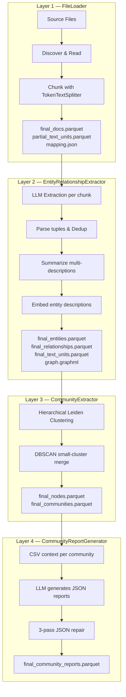
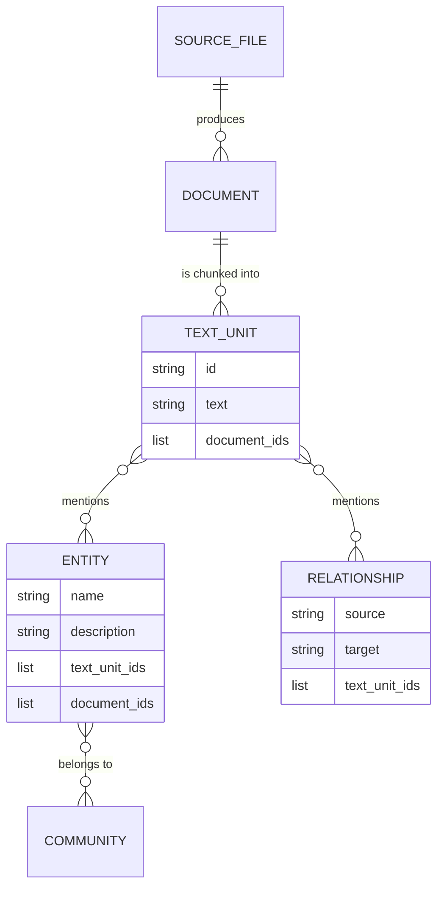
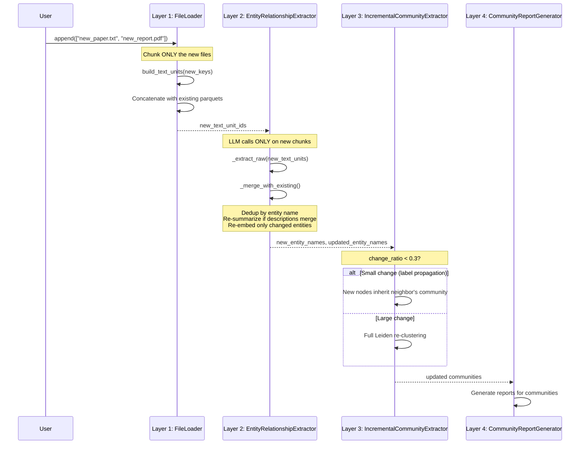
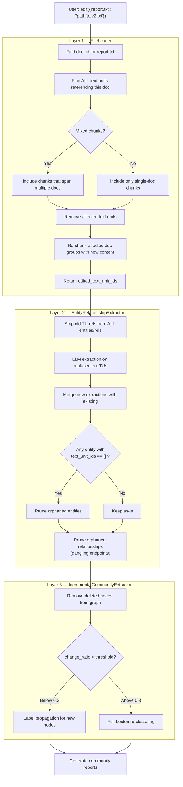
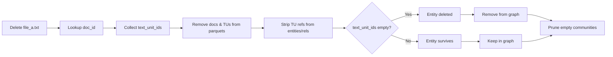
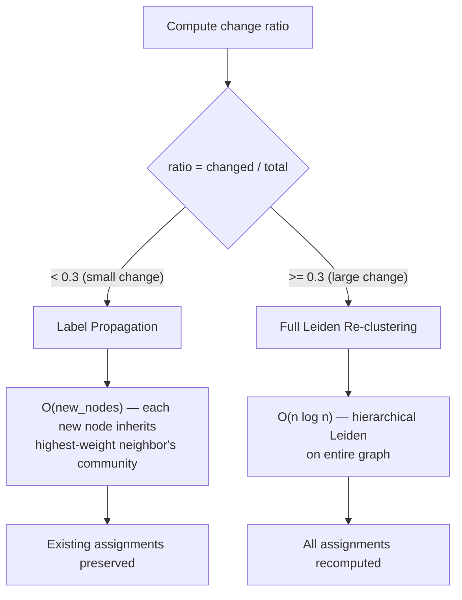
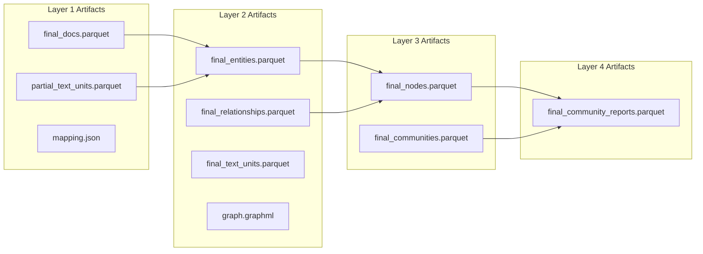

"""
Provided by Nirvai (Nirvana). Author: Benjamin González Guerrero.
"""

# Incremental Pipeline

## Why Incremental Updates Matter

Imagine a library with 10,000 books. A librarian has already catalogued every book:
indexed every person, place, and concept mentioned in them, drawn connections
between related ideas, and grouped them into thematic sections with summary cards.

Now a patron donates 3 new books. Should the librarian throw away the entire
catalogue and start over? Of course not. They should read only the new books,
add their entries to the existing catalogue, draw connections to what's already
there, and update only the affected sections.

That is exactly what GRAIL's incremental pipeline does. When you add, edit, or
remove source files, GRAIL touches **only what changed** — the new text chunks,
the affected entities and relationships, the impacted communities — and leaves
everything else intact. For a corpus of thousands of documents, this can reduce
an operation from hours to minutes.

---

## The Full Pipeline at a Glance

Before diving into the incremental logic, here is the full indexing pipeline
that runs when you call `grail.index()` for the first time. The incremental
operations are surgical variants of this same flow.



Each layer produces parquet artifacts that downstream layers consume. The
incremental pipeline modifies this flow so that each layer processes **only the
delta** — the part that actually changed.

---

## The Central Mechanism: Provenance Tracking

The entire incremental system rests on one idea: **every piece of knowledge
remembers where it came from**.



Think of `text_unit_ids` as citation footnotes. Every entity says _"I was
extracted from these specific text chunks."_ Every text chunk says _"I came from
these specific documents."_ This chain of provenance — file to document to
chunk to entity — is what lets us trace the blast radius of any change.

When you delete a file, we follow the chain:

1. **File** → which **documents** does it produce?
2. **Documents** → which **text units** belong to them?
3. **Text units** → which **entities** and **relationships** reference them?
4. Strip those references. Entities left with zero references? They're orphans — prune them.

No guesswork, no heuristics. Pure reference counting.

---

## The Three Incremental Operations

### Append — Adding New Files

The simplest case. New knowledge enters the system, nothing existing is disturbed.

**Analogy:** Adding new books to the library. The existing catalogue stays
exactly as it is. We only process the new books, and if they mention people or
concepts already in the catalogue, we enrich those entries.



**What's cheap:** Existing entities, relationships, embeddings, and communities
are never recomputed. LLM calls scale with the number of new text units, not
the total corpus size.

**The merge step in detail:**

For each entity extracted from the new chunks:

- **Name already exists?** Combine the old and new descriptions, ask the LLM to
  summarize them into one, merge `text_unit_ids`, re-embed the updated description.
  The entity ID is preserved — downstream references stay valid.
- **Entirely new name?** Create a new entity record with a fresh ID, embed its
  description.

Relationships follow the same logic, keyed by the sorted pair `(source, target)`.
Weight is averaged, descriptions are merged and re-summarized.

---

### Edit — Replacing File Content

The most complex operation. Editing a file means the text chunks change, which
means the entities extracted from those chunks may change, which means
relationships and communities may shift.

**Analogy:** A book in the library gets a revised edition. The librarian must
find every catalogue entry that cites that book, check whether the cited facts
still hold in the new edition, and update or remove entries that are no longer
supported.



**The tricky part: mixed-document chunks.** GRAIL's chunker concatenates files
with `---DOCUMENT_BOUNDARY---` separators, then chunks the combined text.
This means a single text unit can straddle two (or more) documents. When you
edit one of those documents, the chunk must be reconstructed from *both*
documents — the edited one and the untouched neighbor.

`batch_edit_documents` handles this by:

1. Finding every text unit whose `document_ids` list contains any edited doc
2. Grouping those text units by their document combination (e.g., `(doc_A, doc_B)`)
3. Reassembling each group's content — new content for edited docs, original
   content for their untouched neighbors
4. Re-chunking the reassembled content

**The strip-and-merge dance:**

After re-chunking, we need to reconcile the entity layer. This is a two-phase
operation:

1. **Strip**: Remove references to the *old* text unit IDs from every entity
   and relationship. This is like erasing the old citations from the catalogue.
2. **Merge**: Extract entities from the *new* text units and merge them in.
   Same name? Re-summarize and re-embed. New name? Create a new record.

After both phases, some entities may have lost all their citations (the edited
text no longer mentions them, and no other text ever did). These **orphans**
are pruned from the graph entirely.

---

### Delete — Removing Files

The cleanest operation. No LLM calls are needed at the entity layer — it's
pure data manipulation.

**Analogy:** A book is withdrawn from the library. The librarian doesn't need
to re-read anything. They just remove every catalogue entry that *only* cited
that book. Entries that also cite other books survive — they just lose one
footnote.



**Cost:** Zero LLM calls, zero embedding calls. The only computation is
set-subtraction on `text_unit_ids` lists and filtering empty rows. Even for
a large graph, this completes in seconds.

---

## Community Update Strategy

When entities change, the community structure may need updating. GRAIL uses
a **change-ratio scheduler** to decide how much work to do:



**Label propagation** is the cheap path. For each new node, we look at its
neighbors in the graph, find which community has the strongest connection
(by edge weight), and assign the new node there. Existing nodes keep their
communities. This is the right choice when you're adding a few documents to a
large corpus — the community structure is fundamentally stable, you just need
to place the newcomers.

**Full Leiden re-clustering** fires when a significant fraction of the graph
changed (default threshold: 30%). At that point, label propagation would
produce poor results because the topology has shifted too much. It's better
to re-run the full hierarchical Leiden algorithm and let it find the new
natural clusters.

The threshold is configurable:

```yaml
community:
  incremental_change_threshold: 0.3
```

---

## What Gets Saved: The Artifact Map

Every stage writes specific parquet files. Understanding which file holds what
is essential for debugging incremental operations.



| Artifact | Producer | Key Columns | Role in Incremental |
|----------|----------|-------------|---------------------|
| `final_docs.parquet` | FileLoader | `id, text_unit_ids, raw_content, title, path` | Rows added/removed/updated per operation |
| `partial_text_units.parquet` | FileLoader | `id, text, n_tokens, document_id, document_ids` | Chunks added/removed; mixed-doc `document_ids` drives edit blast radius |
| `mapping.json` | FileLoader | `doc_id -> {original_path, title, extension, size_chars}` | Citation root; entries added/removed with docs |
| `final_entities.parquet` | EntityRelationshipExtractor | `id, name, type, description, description_embedding, text_unit_ids, document_ids, degree` | `text_unit_ids` is the provenance field that drives incremental logic |
| `final_relationships.parquet` | EntityRelationshipExtractor | `id, source, target, description, weight, text_unit_ids, document_ids, rank` | Same `text_unit_ids` tracking; pruned if endpoints are pruned |
| `final_text_units.parquet` | EntityRelationshipExtractor | `id, text, entity_ids, relationship_ids` | Annotated version of `partial_text_units` with entity/rel back-pointers |
| `entity_relationship_graph.graphml` | EntityRelationshipExtractor | NetworkX graph (nodes=entities, edges=relationships) | Rebuilt from DataFrames on each incremental operation |
| `final_nodes.parquet` | CommunityExtractor | `level, community, title, id, type, description, degree` | Per-level community assignment for each entity |
| `final_communities.parquet` | CommunityExtractor | `id, level, community, entity_ids, size` | Community membership; empty communities pruned on delete |
| `final_community_reports.parquet` | CommunityReportGenerator | `id, community, title, summary, full_content, rank` | JSON narrative reports; regenerated for affected communities |

---

## Design Decisions & Tradeoffs

### Selective LLM Calls

The most expensive part of the pipeline is LLM extraction (Layer 2). The
incremental design ensures LLM calls scale with the *change size*, not the
*corpus size*:

| Operation | LLM Calls (Layer 2) | Embedding Calls | Community Cost |
|-----------|---------------------|-----------------|----------------|
| **Append** | New chunks only | New + changed entities only | Label prop or Leiden |
| **Edit** | Replacement chunks only | Changed entities only | Label prop or Leiden |
| **Delete** | **Zero** | **Zero** | Community rebuild (no LLM) |

For a 10,000-document corpus where you append 5 files producing 20 text units,
you make ~20 LLM calls instead of ~50,000.

### Orphan Cleanup is Automatic

You never need to manually garbage-collect the graph. The reference-counting
mechanism handles it:

- An entity with `text_unit_ids == []` is an entity that no text in the corpus
  mentions. It gets deleted.
- A relationship whose source or target entity was deleted is a dangling edge.
  It gets deleted.
- A community with no remaining members is an empty cluster. It gets pruned.

This cascading cleanup happens as a natural consequence of the strip-and-prune
logic, not as a separate maintenance step.

### The Entity Merge is Idempotent by Name

Entity deduplication uses the **uppercased entity name** as the key. If two
different text chunks both mention "ALBERT EINSTEIN", they produce the same
entity. Their descriptions are combined and summarized, their `text_unit_ids`
are unioned.

This means appending a document that mentions the same entities as existing
documents does not create duplicates — it enriches the existing entries with
additional context and provenance.

Relationships use the **sorted pair `(source, target)`** as their key, since
the graph is undirected. Two chunks describing the same relationship between
two entities produce one merged relationship with averaged weight and combined
description.

### Mixed-Document Chunks are First-Class

Many Graph RAG implementations treat each document as an isolated chunking
unit. GRAIL concatenates documents with boundary markers and chunks the
combined text. This means a text unit can contain content from multiple
documents, which improves context quality at chunk boundaries but complicates
edits.

The `document_ids` field (a list, not a single ID) on each text unit is what
makes this work. When any document in that list changes, the entire mixed chunk
must be reconstructed and re-chunked. The edit pipeline handles this
automatically by grouping affected chunks by their document combination.

---

## API Reference

```python
from grail.core import GRAIL

grail = GRAIL.from_config("grail.yaml")

# Full index — first time, or when you want a clean rebuild
result = await grail.index()

# Append — add new files without re-processing existing ones
result = await grail.append(["new_doc.txt", "another_paper.pdf"])

# Edit — replace file content, surgically update the graph
result = await grail.edit({"report_v1.txt": "/path/to/report_v2.txt"})

# Delete — remove files, prune orphaned knowledge
result = await grail.delete(["obsolete_doc.txt"])
```

Each operation returns a dict with metrics specific to the operation:

```python
# Append result
{
    "ok": True,
    "operation": "append",
    "duration_s": 12.3,
    "new_files": 2,
    "new_text_units": 8,
    "new_entities": 15,
    "updated_entities": 3,        # existing entities enriched by new data
    "total_entities": 218,
    "total_relationships": 456,
    "communities": 12,
    "reports": 12,
    "llm_summary": {...},
}

# Delete result
{
    "ok": True,
    "operation": "delete",
    "duration_s": 0.8,            # fast — no LLM calls
    "deleted_files": 1,
    "deleted_text_units": 4,
    "updated_entities": 7,        # had refs stripped but survived
    "deleted_entities": 2,        # orphaned and pruned
    "total_entities": 216,
    "total_relationships": 451,
    "communities": 11,
    "reports": 11,
    "llm_summary": {...},
}
```

---

## Configuration Reference

```yaml
community:
  incremental_change_threshold: 0.3   # Ratio above which full re-clustering fires
  max_cluster_size: 50                 # Leiden max cluster size
  min_community_size: 10               # Communities below this are merged by DBSCAN
  embedding_merge_eps: 0.5             # DBSCAN epsilon for centroid-based merge

indexing:
  chunk_size: 2000                     # Tokens per text unit
  chunk_overlap: 50                    # Overlap between chunks
  document_boundary: "\n\n---DOCUMENT_BOUNDARY---\n\n"
```

---

## Summary: What Runs When

```mermaid
graph TD
    subgraph "append()"
        A1["FileLoader.append_files()"] -->|new TU IDs| A2["Extractor.append_extract()"]
        A2 -->|new/updated names| A3["IncrementalCommunity.update()"]
        A3 --> A4["ReportGenerator"]
    end

    subgraph "edit()"
        E1["FileLoader.batch_edit_documents()"] -->|edited TU IDs| E2["Extractor.edit_extract()"]
        E2 -->|new/updated/deleted names| E3["IncrementalCommunity.incremental_edit()"]
        E3 --> E4["ReportGenerator"]
    end

    subgraph "delete()"
        D1["FileLoader.batch_delete_documents()"] -->|deleted TU IDs| D2["Extractor.delete_extract()"]
        D2 -->|updated/deleted names| D3["IncrementalCommunity.incremental_delete()"]
        D3 --> D4["ReportGenerator"]
    end

    style A2 fill:#ffd,stroke:#aa0
    style E2 fill:#ffd,stroke:#aa0
    style D2 fill:#dfd,stroke:#0a0

    classDef llm fill:#ffd,stroke:#aa0
    classDef nollm fill:#dfd,stroke:#0a0
```



> Yellow = LLM calls required. Green = no LLM calls (pure data manipulation).
