"""
Provided by Nirvai (Nirvana). Author: Benjamin González Guerrero.
"""

# Incremental Pipeline

GRAIL supports three incremental operations — **append**, **edit**, and
**delete** — that update the knowledge graph without rebuilding it from
scratch. Each operation propagates through three layers, each feeding the
next.

---

## Full Indexing Pipeline (reference)

Before understanding the incremental path, here is the full pipeline that
`grail.index()` runs:

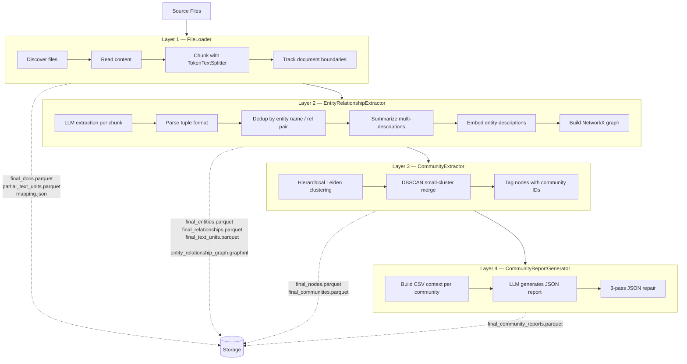

---

## The Incremental Architecture

### Central Mechanism: Text-Unit Reference Tracking

Every entity and relationship stores a `text_unit_ids` list — the IDs of text
chunks that mention it. This provenance chain is the backbone of incremental
updates.

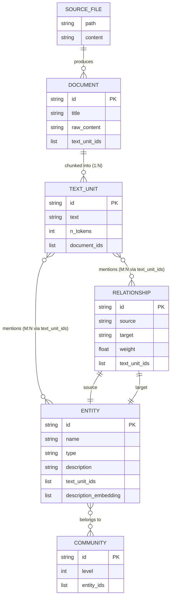

When a file is edited or deleted, the text units change. We trace the impact
through `text_unit_ids` to find which entities and relationships are affected,
update their references, and prune those that become orphaned (zero remaining
references).

---

### Data Flow per Operation

#### Append (add new files)

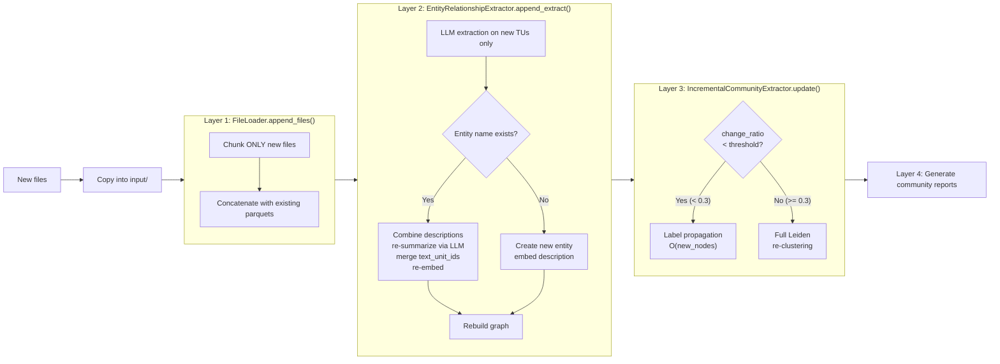

#### Edit (replace file content)

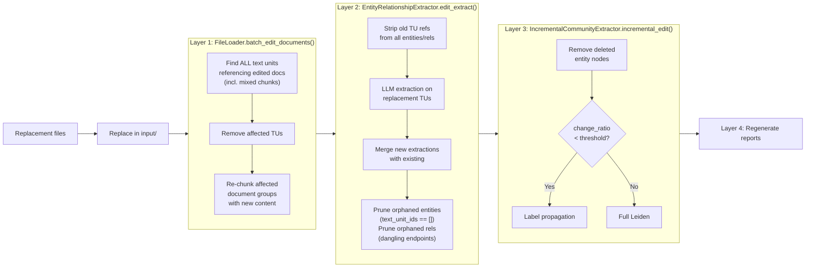

#### Delete (remove files)

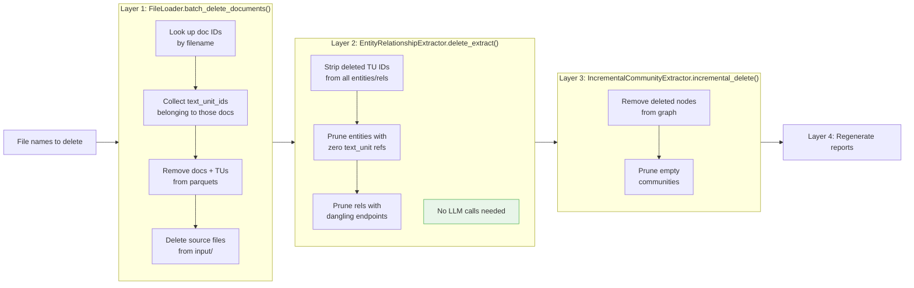

---

### Side-by-Side: What Each Operation Touches

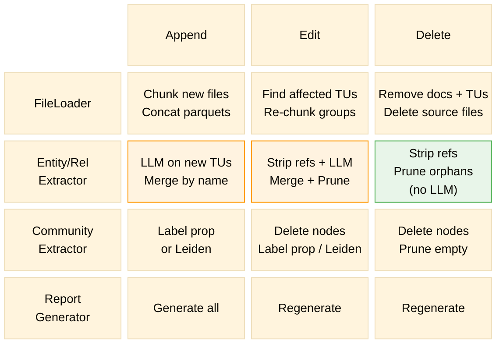

---

## Key Design Decisions

### Selective LLM Calls

Only new or changed text units go through LLM extraction. For a 1000-document
corpus where you append 5 files, only those 5 files' chunks hit the LLM —
the existing 995 files' entities and relationships are preserved as-is.

For delete operations, **no LLM calls are needed at all** in Layer 2. The
operation is pure data manipulation: strip references, prune orphans.

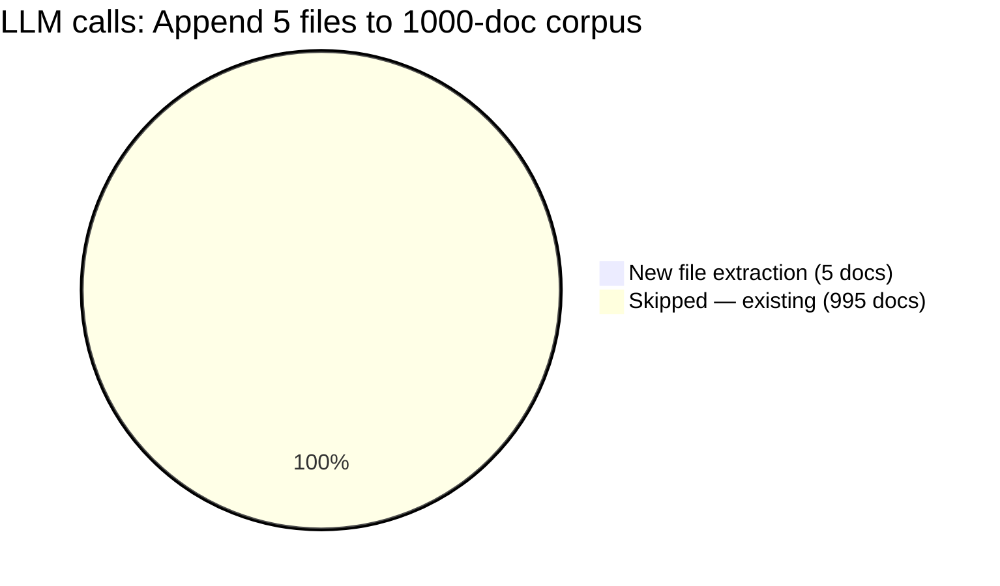

### Selective Re-Embedding

Entity description embeddings are expensive. The incremental path only
re-embeds entities whose descriptions actually changed:

| Operation | Re-embed? | Why |
|-----------|-----------|-----|
| **Append** — new entity | Yes | No prior embedding exists |
| **Append** — merged entity | Yes | Description was re-summarized |
| **Append** — untouched entity | No | Description unchanged |
| **Edit** — updated entity | Yes | Description was re-summarized |
| **Edit** — orphaned entity | No | Entity is deleted entirely |
| **Delete** — any entity | No | Either unchanged or deleted |

### Mixed-Document Chunk Handling

Text units can span multiple documents when chunks straddle a
`---DOCUMENT_BOUNDARY---`. This means editing one document can affect chunks
that also contain content from adjacent documents.

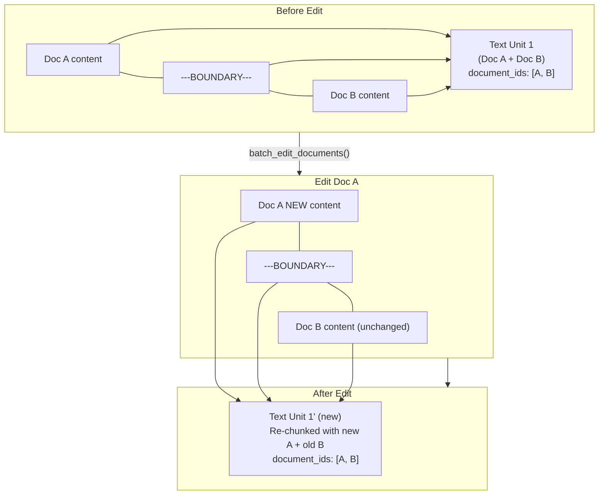

`batch_edit_documents` handles this by:
1. Finding all text units that reference *any* edited doc (via `document_ids`)
2. Grouping them by their document combination
3. Re-assembling the combined content (using new content for edited docs,
   existing content for untouched docs in the same group)
4. Re-chunking the combined content

### Orphan Cleanup

The pruning logic ensures the graph stays clean:

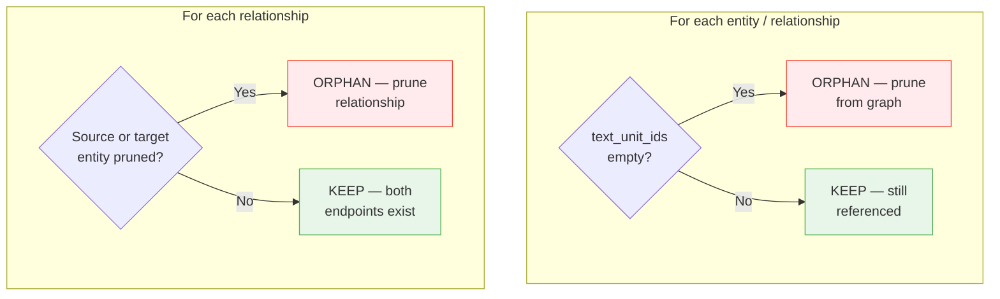

### Community Update Strategy

The `IncrementalCommunityExtractor` uses a change-ratio scheduler:

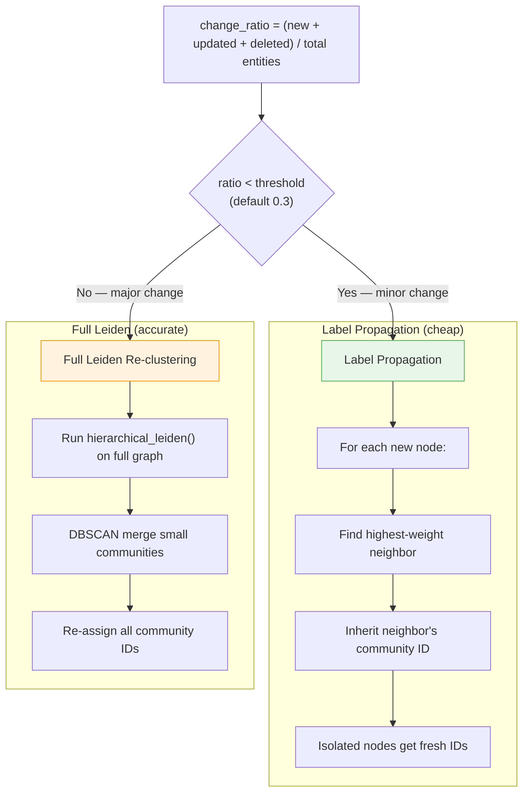

The threshold is configurable via `community.incremental_change_threshold` in
the YAML config.

---

## Class Diagram

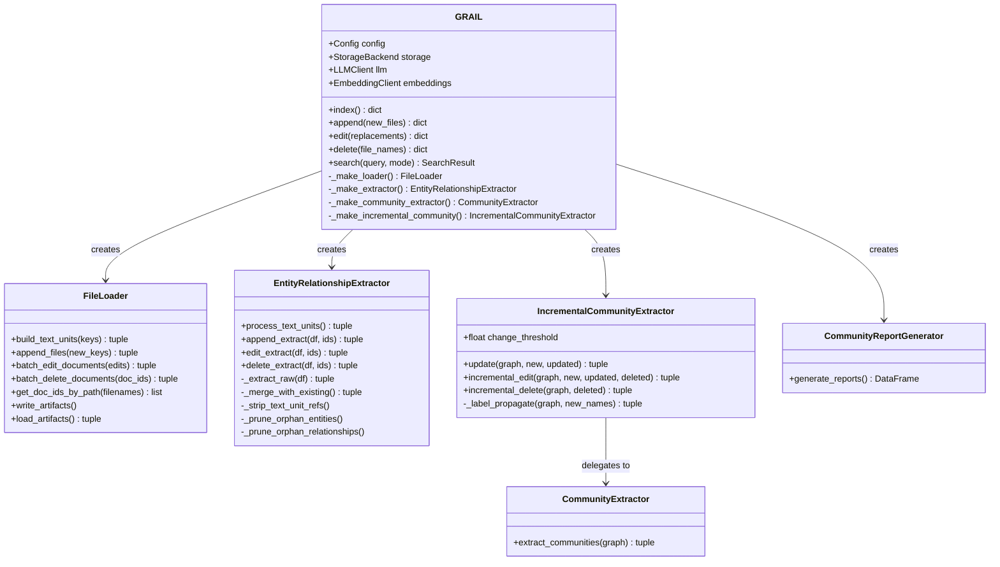

---

## Parquet Artifact Reference

| File | Producer | Key Columns |
|------|----------|-------------|
| `final_docs.parquet` | FileLoader | `id, text_unit_ids, raw_content, title, path` |
| `partial_text_units.parquet` | FileLoader | `id, text, n_tokens, document_id, document_ids` |
| `final_text_units.parquet` | EntityRelationshipExtractor | + `entity_ids, relationship_ids` |
| `final_entities.parquet` | EntityRelationshipExtractor | `id, name, type, description, description_embedding, text_unit_ids, document_ids, degree` |
| `final_relationships.parquet` | EntityRelationshipExtractor | `id, source, target, description, weight, text_unit_ids, document_ids, rank` |
| `entity_relationship_graph.graphml` | EntityRelationshipExtractor | NetworkX graph |
| `final_nodes.parquet` | CommunityExtractor | `level, community, title, id, type, description, degree` |
| `final_communities.parquet` | CommunityExtractor | `id, level, community, entity_ids, size` |
| `final_community_reports.parquet` | CommunityReportGenerator | `id, community, title, summary, full_content, rank` |
| `mapping.json` | FileLoader | `doc_id -> {original_path, title, extension, data_type, size_chars}` |

---

## Configuration

```yaml
community:
  incremental_change_threshold: 0.3   # ratio above which full re-clustering triggers
  max_cluster_size: 50                 # Leiden max cluster size
  min_community_size: 10               # DBSCAN merge threshold for small communities
  embedding_merge_eps: 0.5             # DBSCAN epsilon for centroid-based merge
```

---

## API

```python
grail = GRAIL.from_config("grail.yaml")

# Full index (first time)
result = await grail.index()

# Append new files (incremental)
result = await grail.append(["new_doc.txt", "another.pdf"])

# Edit existing files (incremental)
result = await grail.edit({"old_doc.txt": "/path/to/new_version.txt"})

# Delete files (incremental)
result = await grail.delete(["unwanted.txt"])
```

Each operation returns a dict with operation-specific metrics:

```python
{
    "ok": True,
    "operation": "append",
    "duration_s": 12.3,
    "new_files": 2,
    "new_text_units": 8,
    "new_entities": 15,
    "updated_entities": 3,
    "total_entities": 218,
    "total_relationships": 456,
    "communities": 12,
    "reports": 12,
    "llm_summary": {...},
}
```

---

## Sequence Diagram: Append Operation

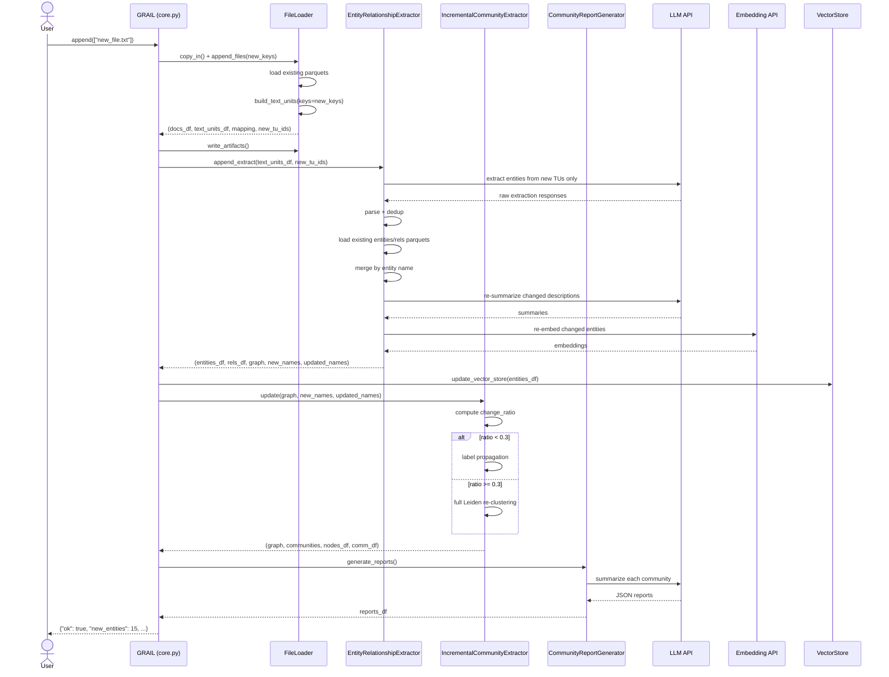
