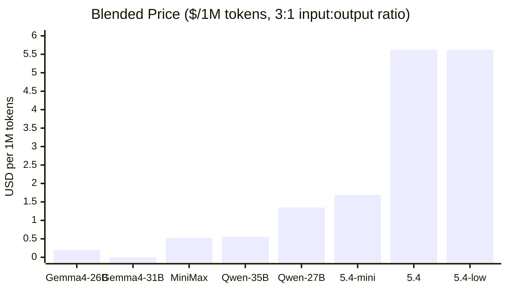
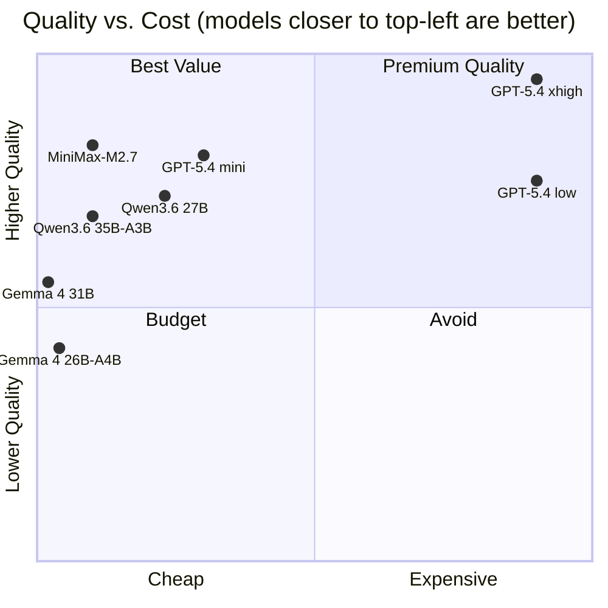
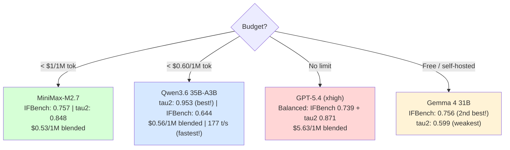

# GRAIL Model Selection Report

> **Date:** 2026-05-18 | **Data source:** [Artificial Analysis](https://artificialanalysis.ai/) |
> **How to reproduce:** see [README.md](README.md)

---

## 1. Why model choice matters for GRAIL

GRAIL's pipeline has three distinct stages, each with different model requirements.
Choosing the wrong model for a stage can mean missed entities, broken JSON, hallucinated
answers, or a 10x cost difference for the same quality.

```mermaid
flowchart LR
    subgraph "Stage 1: Entity & Relationship Extraction"
        direction TB
        A1[Source documents] --> A2[LLM extracts entities\nand relationships]
        A2 --> A3[Graph + Parquet artifacts]
    end

    subgraph "Stage 2: Community Reports"
        direction TB
        B1[Communities from\nLeiden algorithm] --> B2[LLM summarizes each\ncommunity as JSON]
        B2 --> B3[Community report\nParquet]
    end

    subgraph "Stage 3: Query / Inference"
        direction TB
        C1[User query] --> C2[LLM answers using\ngraph context]
        C2 --> C3[Cited response]
    end

    A3 --> B1
    B3 --> C1

    style A2 fill:#ffd6d6,stroke:#c00
    style B2 fill:#d6e8ff,stroke:#00c
    style C2 fill:#d6ffd6,stroke:#0a0
```



### What each stage needs from the model

| Requirement | Stage 1: Extraction | Stage 2: Communities | Stage 3: Inference |
|---|:---:|:---:|:---:|
| **Format compliance** (IFBench) | Critical | Critical | Low |
| **Tool use / structured output** (tau2) | Critical | Medium | Low |
| **Overall intelligence** | High | High | Critical |
| **Factual accuracy** (GPQA) | Medium | Medium | Critical |
| **Long context recall** (LCR) | High | Medium | High |
| **Speed** (tok/s) | High | Medium | Medium |
| **Cost sensitivity** | Critical | High | Medium |

---

## 2. Models compared

All models evaluated in **reasoning mode** (highest quality configuration).

| Model | Creator | Params | Architecture |
|-------|---------|--------|-------------|
| GPT-5.4 (xhigh) | OpenAI | Undisclosed | Proprietary |
| GPT-5.4 mini (xhigh) | OpenAI | Undisclosed | Proprietary (distilled) |
| GPT-5.4 (low) | OpenAI | Undisclosed | Proprietary (lower effort) |
| Qwen3.6 27B | Alibaba | 27B | Dense transformer |
| Qwen3.6 35B-A3B | Alibaba | 35B (3B active) | Mixture of Experts |
| Gemma 4 31B | Google | 31B | Dense transformer |
| Gemma 4 26B-A4B | Google | 26B (4B active) | Mixture of Experts |
| MiniMax-M2.7 | MiniMax | Undisclosed | Proprietary |

---

## 3. Benchmark results — Entity Extraction

The key benchmarks for entity extraction are **IFBench** (can the model follow the strict
`("entity"<|>TYPE<|>DESCRIPTION)` tuple format?) and **tau2-Bench** (can it reliably use
structured schemas?). Long Context Recall matters because extraction prompts include the
full text chunk.

```
IFBench — Format Compliance (higher is better)
(scale 0-1, critical for entity extraction parser)

MiniMax-M2.7         ████████████████████████████████████████  0.757
Gemma 4 31B          ███████████████████████████████████████▉  0.756
GPT-5.4 (xhigh)     ████████████████████████████████████████  0.739
GPT-5.4 mini (xhigh) ███████████████████████████████████████  0.733
Gemma 4 26B-A4B      ██████████████████████████████████████▊  0.724
Qwen3.6 27B          █████████████████████████████████████▊   0.676
GPT-5.4 (low)        ████████████████████████████████████▊    0.659
Qwen3.6 35B-A3B      ████████████████████████████████████▍    0.644
```

```
tau2-Bench — Structured Output / Tool Use (higher is better)
(scale 0-1, critical for reliable schema adherence)

Qwen3.6 35B-A3B      ████████████████████████████████████████  0.953
Qwen3.6 27B          ███████████████████████████████████████▍  0.942
GPT-5.4 (xhigh)      ████████████████████████████████████▌    0.871
MiniMax-M2.7          ███████████████████████████████████▌     0.848
GPT-5.4 mini (xhigh)  ██████████████████████████████████▉     0.833
GPT-5.4 (low)         █████████████████████████████████▏      0.746
Gemma 4 31B           ████████████████████████████▎           0.599
Gemma 4 26B-A4B       ████████████████████████▋               0.436
```

```
Long Context Recall (higher is better)
(scale 0-1, ability to find information in long prompts)

GPT-5.4 (xhigh)      ████████████████████████████████████████  0.740
GPT-5.4 mini (xhigh)  █████████████████████████████████████▍   0.693
Qwen3.6 27B           █████████████████████████████████████▍   0.687
MiniMax-M2.7           █████████████████████████████████████▍   0.687
GPT-5.4 (low)          ████████████████████████████████████▎    0.673
Qwen3.6 35B-A3B        ██████████████████████████████████▍     0.637
Gemma 4 31B            █████████████████████████████████▍      0.620
Gemma 4 26B-A4B        █████████████████████████████████       0.557
```

### Extraction takeaway

The Qwen3.6 models dominate tau2 (structured output) but lag on IFBench (strict format).
MiniMax-M2.7 and Gemma 4 31B lead IFBench. For GRAIL's specific tuple parser, both
dimensions matter — a model that follows schemas but not exact delimiters, or vice versa,
will still drop entities.

---

## 4. Benchmark results — Community Reports

Community report generation needs the model to condense graph-community information into
a structured JSON format. This demands intelligence (summarization quality) and format
compliance (JSON output).

```
Intelligence Index (higher is better)
(scale 0-100, composite of 10 benchmarks)

GPT-5.4 (xhigh)      ████████████████████████████████████████  56.8
MiniMax-M2.7          ██████████████████████████████████▉      49.6
GPT-5.4 mini (xhigh)  ████████████████████████████████████▍    48.9
GPT-5.4 (low)          ███████████████████████████████████▊    47.9
Qwen3.6 27B            ██████████████████████████████████▎     45.8
Qwen3.6 35B-A3B        █████████████████████████████████▎     43.5
Gemma 4 31B            ████████████████████████████████        39.2
Gemma 4 26B-A4B        █████████████████████████████          31.2
```

### Community reports takeaway

For generating structured JSON community summaries, GPT-5.4 (xhigh) leads on intelligence
but at a steep price. MiniMax-M2.7 offers near-GPT-5.4-mini intelligence at 1/3 the cost.
For budget pipelines, Qwen3.6 35B-A3B gives reasonable quality at $0.56/1M tokens.

---

## 5. Benchmark results — Query Inference

At query time, the model must answer user questions grounded in graph context without
hallucinating facts. GPQA Diamond (expert-level factual accuracy) is the closest proxy
for hallucination resistance.

```
GPQA Diamond — Factual Accuracy (higher is better)
(scale 0-1, PhD-level science questions — proxy for hallucination)

GPT-5.4 (xhigh)      ████████████████████████████████████████  0.920
GPT-5.4 mini (xhigh)  ██████████████████████████████████████▉  0.875
MiniMax-M2.7           ██████████████████████████████████████▊  0.874
GPT-5.4 (low)          ████████████████████████████████████████  0.871
Gemma 4 31B            ██████████████████████████████████████▍  0.857
Qwen3.6 27B            █████████████████████████████████████▊  0.842
Qwen3.6 35B-A3B        █████████████████████████████████████▊  0.841
Gemma 4 26B-A4B        ████████████████████████████████████▎   0.792
```

```
Humanity's Last Exam — Frontier Reasoning (higher is better)
(scale 0-1, hardest knowledge test available)

GPT-5.4 (xhigh)      ████████████████████████████████████████  0.416
GPT-5.4 (low)         ████████████████████████████████         0.289
MiniMax-M2.7          ████████████████████████████████         0.281
GPT-5.4 mini (xhigh) ███████████████████████████▍             0.266
Gemma 4 31B           ██████████████████████████▎              0.227
Qwen3.6 27B           ████████████████████████▋                0.216
Qwen3.6 35B-A3B       ████████████████████████                 0.202
Gemma 4 26B-A4B       █████████████████████████                0.183
```

### Inference takeaway

GPT-5.4 (xhigh) is the clear winner for factual accuracy and hard reasoning, but
MiniMax-M2.7 and GPT-5.4 mini (xhigh) are surprisingly close on GPQA at a fraction
of the cost. For most GRAIL query workloads (where the answer is grounded in the
graph context, not pure world knowledge), the gap narrows further.

---

## 6. Pricing comparison



### Detailed pricing table

| Model | Input $/1M | Output $/1M | Blended $/1M | Cached Input* | Speed (tok/s) |
|-------|----------:|----------:|----------:|----------:|----------:|
| Gemma 4 31B | $0.00 | $0.00 | **$0.00** | $0.00 | 35 |
| Gemma 4 26B-A4B | $0.13 | $0.40 | **$0.20** | ~$0.07 | N/A |
| MiniMax-M2.7 | $0.30 | $1.20 | **$0.53** | ~$0.15 | 53 |
| Qwen3.6 35B-A3B | $0.25 | $1.49 | **$0.56** | ~$0.12 | 177 |
| Qwen3.6 27B | $0.60 | $3.60 | **$1.35** | ~$0.30 | 62 |
| GPT-5.4 mini (xhigh) | $0.75 | $4.50 | **$1.69** | ~$0.38 | 163 |
| GPT-5.4 (xhigh) | $2.50 | $15.00 | **$5.63** | ~$1.25 | 81 |
| GPT-5.4 (low) | $2.50 | $15.00 | **$5.63** | ~$1.25 | 63 |

\* *Cached input prices are estimated at ~50% of input price for providers that support
prompt caching (OpenAI, Anthropic). GRAIL's extraction pipeline sends the same system
prompt repeatedly across chunks, making cached inputs significant for high-volume
indexing. Exact cached pricing varies by provider — check their current documentation.*

### Cost impact on a real workload

For a corpus of ~200 pages (similar to the 19 SEOM PDFs in `sample_data/`), assuming
~500K input tokens and ~150K output tokens across the full pipeline:

| Model | Estimated indexing cost |
|-------|----------------------:|
| Gemma 4 31B (free tier) | **$0.00** |
| Gemma 4 26B-A4B | **$0.13** |
| Qwen3.6 35B-A3B | **$0.35** |
| MiniMax-M2.7 | **$0.33** |
| Qwen3.6 27B | **$0.84** |
| GPT-5.4 mini (xhigh) | **$1.05** |
| GPT-5.4 (xhigh) | **$3.50** |

---

## 7. Speed comparison

```
Output Speed (tokens/second, higher is better)

Qwen3.6 35B-A3B      ████████████████████████████████████████  177 t/s
GPT-5.4 mini (xhigh) █████████████████████████████████████▏   163 t/s
GPT-5.4 (xhigh)      ██████████████████▎                       81 t/s
GPT-5.4 (low)         ██████████████▍                           63 t/s
Qwen3.6 27B           ██████████████                            62 t/s
MiniMax-M2.7          ████████████                              53 t/s
Gemma 4 31B           ████████                                  35 t/s
Gemma 4 26B-A4B       (no speed data available)                  — t/s
```

Qwen3.6 35B-A3B stands out: fastest model in the comparison AND one of the cheapest.
This is the MoE advantage — only 3B parameters are active per token, enabling high
throughput at low cost.

---

## 8. Composite view — Quality vs. Cost frontier



---

## 9. Per-stage recommendations

### Stage 1: Entity & Relationship Extraction



**Top pick: MiniMax-M2.7** — Best balance across all three extraction-critical benchmarks
(IFBench, tau2, LCR) at $0.53/1M tokens. It scores #1 on IFBench among models under $1,
and its tau2 score (0.848) is strong.

**Budget pick: Qwen3.6 35B-A3B** — Highest tau2 score in the entire comparison (0.953),
meaning it follows structured schemas extremely well. The lower IFBench (0.644) means it
may need the JSON correction pass more often, but at $0.56/1M and 177 tok/s, it processes
large corpora fast and cheap.

**Self-hosted pick: Gemma 4 31B** — Free, excellent IFBench (0.756), but weak tau2 (0.599).
Good for users who want to run the pipeline locally with no API costs.

### Stage 2: Community Report Generation

**Top pick: MiniMax-M2.7** — Intelligence 49.6 (near GPT-5.4 mini) with IFBench 0.757
for reliable JSON output, at $0.53/1M. The JSON correction loop in GRAIL handles
occasional format errors.

**Premium pick: GPT-5.4 mini (xhigh)** — Intelligence 48.9, IFBench 0.733, and 163 tok/s.
Worth the premium ($1.69/1M) if community report quality is paramount.

### Stage 3: Query / Inference

**Top pick: GPT-5.4 mini (xhigh)** — GPQA 0.875 (strong factual accuracy), Intelligence
48.9, and the query stage processes far fewer tokens than indexing, so the higher cost
is manageable.

**Budget pick: MiniMax-M2.7** — GPQA 0.874 (virtually identical to GPT-5.4 mini), at
$0.53/1M.

**Premium pick: GPT-5.4 (xhigh)** — GPQA 0.920, HLE 0.416 (far ahead on hard reasoning).
Justified for use cases where answer accuracy is critical and query volume is low.

---

## 10. Recommended configurations

### Default configuration (balanced)

Use a single model across all stages for simplicity:

```yaml
# grail.yaml — balanced default
llm:
  endpoint: minimax
  model: MiniMax-M2.7

embedding:
  endpoint: deepinfra
  model: intfloat/multilingual-e5-large
```

**Why:** MiniMax-M2.7 ranks in the top 3 for every stage-critical benchmark, costs
$0.53/1M blended, and avoids the complexity of multi-model routing. For most users,
this is the right starting point.

### High-throughput configuration (large corpora)

Optimize for speed and cost during indexing, upgrade for query:

```yaml
# grail.yaml — high-throughput
llm:
  # Used for entity extraction + community reports
  endpoint: deepinfra    # or any Qwen3.6-35B-A3B provider
  model: Qwen/Qwen3.6-35B-A3B

query_llm:
  # Used only at query time
  endpoint: minimax
  model: MiniMax-M2.7

embedding:
  endpoint: deepinfra
  model: intfloat/multilingual-e5-large
```

**Why:** Qwen3.6 35B-A3B gives 177 tok/s at $0.56/1M — the fastest and cheapest
combination for bulk indexing. MiniMax-M2.7 handles inference with better factual accuracy.

### Maximum quality configuration

```yaml
# grail.yaml — maximum quality
llm:
  endpoint: openai
  model: gpt-5.4        # uses xhigh reasoning effort

embedding:
  endpoint: openai
  model: text-embedding-3-large
```

**Why:** GPT-5.4 (xhigh) leads on Intelligence (56.8), GPQA (0.920), HLE (0.416), and
LCR (0.740). The cost is ~10x higher than MiniMax, but for small corpora or when accuracy
is non-negotiable, it's the clear choice.

### Self-hosted / air-gapped configuration

```yaml
# grail.yaml — self-hosted via vLLM or Ollama
llm:
  endpoint: local        # points to localhost vLLM/Ollama
  model: gemma-4-31b-it

embedding:
  endpoint: local
  model: intfloat/multilingual-e5-large
```

**Why:** Gemma 4 31B is free, has excellent IFBench (0.756), and runs on a single GPU
with quantization. The weak tau2 (0.599) means you'll want to enable GRAIL's JSON
correction pass and potentially increase extraction retries.

---

## 11. Summary table

| Model | Extraction | Communities | Inference | Cost | Speed | Overall |
|-------|:---:|:---:|:---:|:---:|:---:|:---:|
| **MiniMax-M2.7** | A | A | A | A | B | **Best balanced** |
| **Qwen3.6 35B-A3B** | B+ | B | B | A+ | A+ | **Best throughput** |
| **GPT-5.4 mini (xhigh)** | A- | A | A | B | A | **Best premium** |
| GPT-5.4 (xhigh) | A | A+ | A+ | D | B | Best quality, high cost |
| Qwen3.6 27B | B | B | B | B | B | Solid mid-range |
| Gemma 4 31B | B- | B- | B | A+ | C | Best self-hosted |
| GPT-5.4 (low) | B- | B+ | B+ | D | B | Avoid (same cost as xhigh) |
| Gemma 4 26B-A4B | C | C | C | A+ | N/A | Budget self-hosted only |

---

## 12. Conclusion

**For most GRAIL users, MiniMax-M2.7 is the recommended default.** It offers the best
balance of format compliance, structured output adherence, factual accuracy, and cost
across all three pipeline stages. At $0.53/1M tokens blended, it costs 70% less than
GPT-5.4 mini while matching or exceeding it on extraction-critical benchmarks.

**For large-corpus indexing (100+ documents), consider Qwen3.6 35B-A3B** as the extraction
model. Its 177 tok/s throughput and $0.56/1M cost mean a 1000-page corpus can be indexed
in minutes for under $5. Pair it with MiniMax-M2.7 for query time.

**GPT-5.4 (xhigh) is justified only when answer accuracy is critical** and the corpus
is small enough that the 10x cost premium is acceptable. Its 181-second time-to-first-token
(due to extended reasoning) also makes it impractical for interactive query experiences.

**GPT-5.4 (low) should be avoided** — it costs the same as (xhigh) but scores lower on
every benchmark. Always prefer (xhigh) if you're paying OpenAI prices.

**Gemma 4 31B is the best self-hosted option** with excellent format compliance, but its
weak tau2 score means you should enable GRAIL's retry and JSON correction mechanisms.

> **Important:** These recommendations are based on general benchmarks, not GRAIL-specific
> entity extraction tests. The actual performance on your corpus may differ. Use `grail benchmark`
> (when available) to validate against your specific documents before committing to a model
> for production indexing.

---

*Data: [Artificial Analysis](https://artificialanalysis.ai/) (2026-05-18).
Methodology: [README.md](README.md).
Skill used: [`benchmark-artificialanalysis`](https://github.com/CAMARA-CHILENA-INTELIGENCIA-ARTIFICIAL/cchia_skills).*
