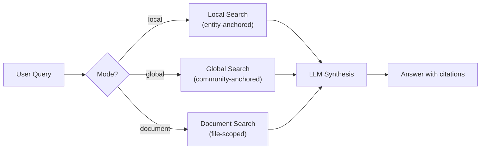
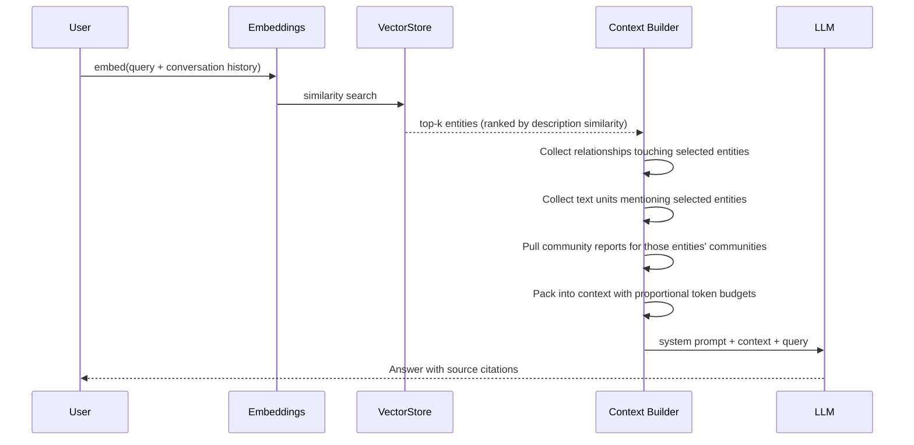
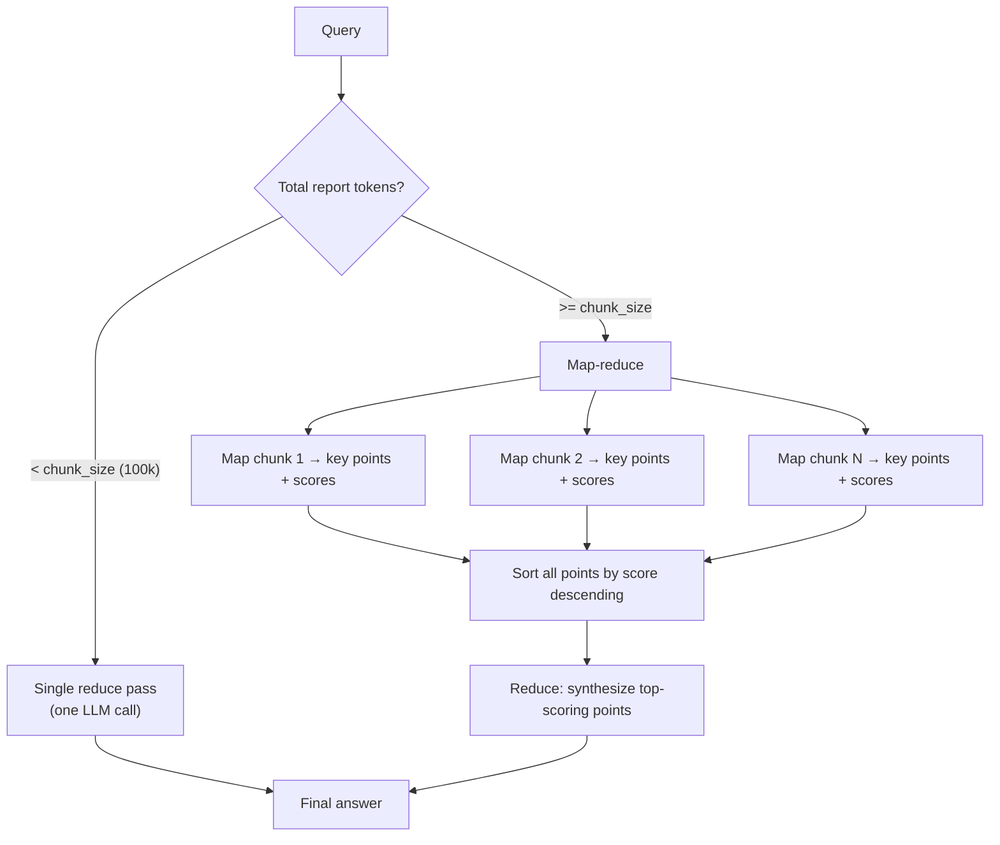
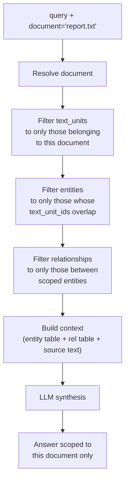
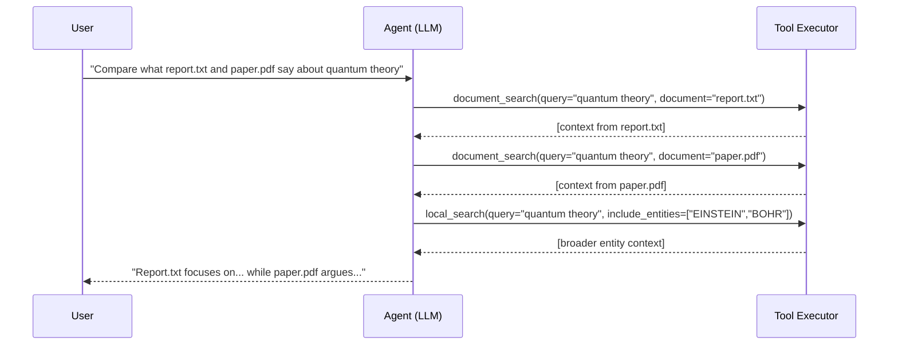
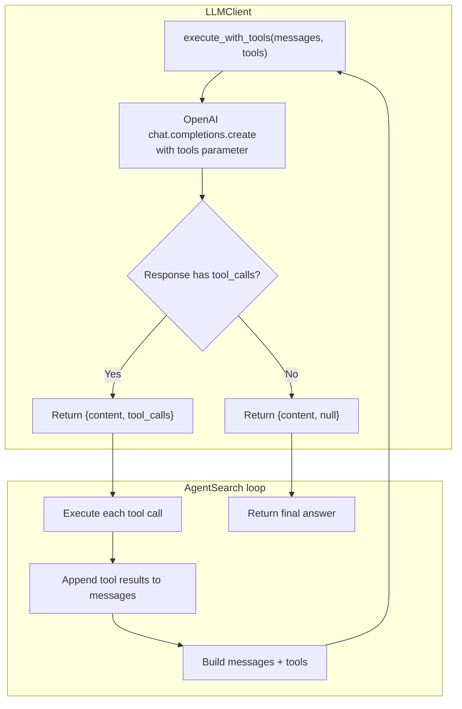
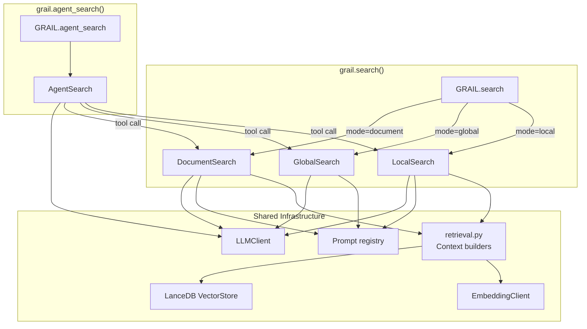

"""
Provided by Nirvai (Nirvana). Author: Benjamin González Guerrero.
"""

# Search & Retrieval

GRAIL provides two ways to query a knowledge graph: **simple inference** (one
search call, one answer) and **agentic search** (the LLM decides which tools
to call and iterates until it has enough context). Both modes build on three
underlying search methods.

---

## The Three Search Methods

Think of a knowledge graph as a city. Local search walks specific streets
looking for landmarks. Global search reads the city's guidebook for themes.
Document search reads a single building's floor plan.



### Local Search

Best for **specific factual questions** — who is X, what is the relationship
between A and B, what happened at event Y.

The pipeline finds the entities most relevant to the query and builds a context
window around them:



**Proportional token budgeting.** The context window is split based on
configurable ratios, not fixed sizes. This means the budgets scale when you
increase `local_max_tokens`:

```
max_tokens (default 8192)
  ├── text_unit_prop  (default 0.5)  →  ~4096 tokens for source text
  ├── community_prop  (default 0.1)  →   ~819 tokens for community reports
  └── local_prop      (remaining)    →  ~3277 tokens split between entity + relationship tables
```

**Conversation history enrichment.** When the user asks a follow-up like
"tell me more about that", the bare query has no useful keywords for entity
matching. GRAIL prepends recent user turns from the conversation history to
the query before embedding it, so the entity selector considers
conversational context. This is capped to `local_conversation_history_max_turns`
(default 5).

**Entity filtering.** You can force-include or force-exclude specific entities:

```python
result = await grail.search(
    "What are their contributions?",
    mode="local",
    include_entity_names=["EINSTEIN", "BOHR"],  # always include these
    exclude_entity_names=["HEISENBERG"],         # never include this
)
```

Forced-include entities are added to the ranked set regardless of similarity
score. Excluded entities are removed after ranking.

### Global Search

Best for **broad, thematic, or comparative questions** — what are the main
themes across all documents, compare the approaches described in the corpus,
summarize the key findings.

Global search operates on community reports rather than individual entities.
Each community report is a pre-generated LLM summary of a cluster of related
entities.



The map step extracts `{description, score}` pairs from each chunk. The
reduce step takes the highest-scoring points and synthesizes a final answer.
This is implemented in-house — the legacy proprietary `ReduceMap` utility is
not used.

### Document Search

Best when the user asks about **a specific source file** — what does report.txt
say about X, summarize the contents of paper.pdf, find information about Y in
this particular document.

Document search restricts the entire retrieval pipeline to a single document:



**Document resolution** is flexible. You can pass:
- A filename: `"report.txt"`
- A path fragment: `"reports/q4"` (matches any path containing this substring)
- A document ID: `"a3f2b1c4-..."` (exact match)

The method tries each in order: exact ID match → path contains → title match →
mapping lookup.

**How scoping works.** Given the resolved document ID(s):

1. Find all text units whose `document_ids` list includes this document
2. Find all entities whose `text_unit_ids` overlap with those text units
3. Find all relationships where both source and target are in the scoped entity set
4. Build context and run LLM synthesis within this restricted scope

This means if an entity is mentioned in both `report.txt` and `paper.pdf`, and
you search within `report.txt`, that entity will appear — but only with its
relationship to other entities also mentioned in `report.txt`.

---

## Two Modes of Operation

### Simple Inference

Call `grail.search()` with a mode. One search, one answer.

```python
# Local: specific question
result = await grail.search("Who is Einstein?", mode="local")

# Global: broad question
result = await grail.search("What are the main themes?", mode="global")

# Document: file-scoped question
result = await grail.search(
    "What does it say about quantum theory?",
    mode="document",
    document="physics_paper.pdf",
)
```

This is the right choice when you know which search mode fits the question, or
when you want predictable, single-shot behavior. The LLM sees the retrieved
context and responds — it doesn't get to choose which search to run.

### Agentic Search

Call `grail.agent_search()`. The LLM receives three tools and decides which to
call, with what parameters, and how many times.

```python
result = await grail.agent_search(
    "Compare what report.txt and paper.pdf say about quantum theory"
)
```



The agent has three tools available:

| Tool | Parameters | When the agent uses it |
|------|------------|----------------------|
| `local_search` | `query`, `include_entities?`, `exclude_entities?`, `top_k?` | Specific factual questions; needs entity-level detail |
| `global_search` | `query` | Broad or thematic questions; needs cross-cutting synthesis |
| `document_search` | `query`, `document` | User references a specific file; needs file-scoped context |

The agent loop runs up to `max_iterations` rounds (default 5). Each round:

1. LLM sees the conversation + any previous tool results
2. LLM either calls a tool (with chosen parameters) or returns a final answer
3. If it calls a tool, the result is appended to the conversation as a `tool` message
4. Loop continues until the LLM responds without tool calls, or max iterations

**The system prompt** instructs the agent to:
- Start with the tool that best matches the question type
- Use entity filtering when it needs to focus
- Use document search when the user references a specific file
- Combine local + global when the user asks for both details and big-picture
- Synthesize a final answer citing sources when it has enough information

You can override the system prompt:

```python
result = await grail.agent_search(
    "...",
    system_prompt="You are an expert analyst. Always start with global search...",
)
```

---

## How Tool Calling Works Internally

The agentic mode uses OpenAI's native function-calling protocol. GRAIL's
`LLMClient` speaks the OpenAI Chat Completions API, so this works with any
provider that supports the same protocol (OpenAI, vLLM, SGLang, etc.).



The `execute_with_tools()` method on `LLMClient` (`grail/llm/wrapper.py`)
handles:
- Semaphore-bounded concurrency (same as regular `execute()`)
- Retry on transient errors and rate limits
- Cost tracking per tool-calling round
- Parsing of `tool_calls` from the response into a clean dict format

---

## Return Values

All search methods return a `SearchResult`:

```python
@dataclass
class SearchResult:
    response: str                         # The LLM's answer
    context_data: dict[str, DataFrame]    # DataFrames used as context
    context_text: str                     # The raw context string sent to the LLM
    completion_time: float                # Wall-clock seconds
    llm_calls: int                        # Total LLM invocations
```

For agentic search, `llm_calls` includes both the agent's reasoning calls and
the search tools' internal LLM calls (entity extraction, map-reduce, etc.).
`context_data` is keyed by `{tool_name}_{artifact_type}` (e.g.
`local_search_entities`, `document_search_sources`).

---

## Configuration Reference

```yaml
search:
  # Local search
  local_search_endpoint: null           # null → inherits from llm.endpoint
  local_search_model: null              # null → inherits from llm.model
  local_max_tokens: 8192                # Total context window for local search
  local_text_unit_prop: 0.5             # Proportion of tokens for source text
  local_community_prop: 0.1             # Proportion of tokens for community reports
  local_conversation_history_max_turns: 5
  local_top_k_entities: 10
  local_top_k_relationships: 10

  # Global search
  global_search_endpoint: null
  global_search_model: null
  global_max_tokens: 6000
  global_map_max_tokens: 2000
  global_reduce_max_tokens: 6000
  global_chunk_size: 100000             # Threshold for single-pass vs map-reduce
  global_concurrency: 5                 # Parallel map calls

  response_type: "Multiple Paragraphs"
```

---

## CLI

```bash
# Simple search
grail query ./my_project "Who is Einstein?" --mode local
grail query ./my_project "What are the main themes?" --mode global
grail query ./my_project "Summarize this file" --mode document --document report.txt

# Agentic search
grail query ./my_project "Compare these two papers" --agent

# Output format
grail query ./my_project "..." --mode local --output json
```

---

## When to Use Which

| Question Type | Mode | Why |
|---------------|------|-----|
| "Who is X?" | `local` | Entity-anchored; needs specific facts |
| "What is the relationship between A and B?" | `local` with `include_entity_names` | Force both entities into context |
| "What are the main themes?" | `global` | Needs cross-cutting community-level synthesis |
| "Summarize this document" | `document` | File-scoped; only that source matters |
| "What does report.txt say about X?" | `document` | File-scoped question |
| "Compare report.txt and paper.pdf on topic Y" | `agent_search` | Needs multiple document searches + synthesis |
| "Find everything about X, starting broad then drilling down" | `agent_search` | Needs global → local refinement |
| Conversational follow-ups ("tell me more") | `local` with conversation history | History enrichment finds entities from prior turns |

---

## Architecture



All three search methods share the same retrieval primitives
(`map_query_to_entities`, `build_entity_context`, `build_relationship_context`,
`build_text_unit_context`, `build_community_context`) and the same LLM/embedding
clients. The agent simply orchestrates calls to these methods through the
tool-calling protocol.
